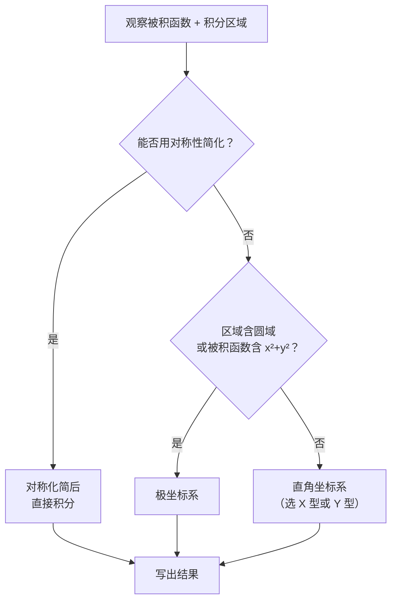

---
tags:
  - 高等数学
  - 多元函数积分学
  - 二重积分
created: 2026-07-19
---

# 二重积分计算

## 一、基本概念

### 1. 几何意义
- **曲顶柱体的体积**：$V = \iint\limits_D f(x,y)\,\mathrm{d}\sigma$（$f(x,y) \ge 0$）
- 物理意义：平面薄片的质量（$f$ 为面密度）

### 2. 二重积分的存在性
> 若 $f(x,y)$ 在有界闭区域 $D$ 上连续，则 $\iint_D f(x,y)\,\mathrm{d}\sigma$ 存在。

---

## 二、计算方法

### 方法一：直角坐标系

#### ① X 型区域
$$D = \{(x,y) \mid a \le x \le b,\ \varphi_1(x) \le y \le \varphi_2(x)\}$$

$$\iint\limits_D f(x,y)\,\mathrm{d}\sigma = \int_a^b \mathrm{d}x \int_{\varphi_1(x)}^{\varphi_2(x)} f(x,y)\,\mathrm{d}y$$

> **记忆口诀**：后积先定限，限内画条线，先交写下限，后交写上限。

#### ② Y 型区域
$$D = \{(x,y) \mid c \le y \le d,\ \psi_1(y) \le x \le \psi_2(y)\}$$

$$\iint\limits_D f(x,y)\,\mathrm{d}\sigma = \int_c^d \mathrm{d}y \int_{\psi_1(y)}^{\psi_2(y)} f(x,y)\,\mathrm{d}x$$

#### ③ 交换积分次序
- 关键步骤：
  1. 由原积分限还原出区域 $D$
  2. 画出区域图
  3. 写出另一种次序的积分限

> ⚠️ **常见陷阱**：积分限中若含变量，说明先对谁积分已经固定，**不能直接交换**，必须还原区域。

---

### 方法二：极坐标系

**变换关系**：
$$
\begin{cases}
x = r\cos\theta \\
y = r\sin\theta
\end{cases}
\quad \mathrm{d}\sigma = r\,\mathrm{d}r\mathrm{d}\theta
$$

$$\iint\limits_D f(x,y)\,\mathrm{d}\sigma = \iint\limits_D f(r\cos\theta, r\sin\theta)\, r\,\mathrm{d}r\mathrm{d}\theta$$

#### 适用情形（优先用极坐标）：
| 特征                         | 说明                               |
| -------------------------- | -------------------------------- |
| 被积函数含 $x^2+y^2$            | $f(x^2+y^2)$、$f(\sqrt{x^2+y^2})$ |
| 积分区域为圆域                    | $x^2+y^2 \le R^2$                |
| 积分区域为环域                    | $a^2 \le x^2+y^2 \le b^2$        |
| 积分区域为扇形                    | 圆的一部分 + 角度范围                     |
| 被积函数含 $\arctan\frac{y}{x}$ | 极坐标下化为 $\theta$                  |

#### 常见积分限设定：

| 区域类型 | $r$ 范围 | $\theta$ 范围 |
|----------|----------|---------------|
| 圆心在原点的圆 | $0 \le r \le R$ | $0 \le \theta \le 2\pi$ |
| 圆心在 $(a,0)$ 的圆 | $0 \le r \le 2a\cos\theta$ | $-\frac{\pi}{2} \le \theta \le \frac{\pi}{2}$ |
| 圆心在 $(0,a)$ 的圆 | $0 \le r \le 2a\sin\theta$ | $0 \le \theta \le \pi$ |
| 环域 | $a \le r \le b$ | $0 \le \theta \le 2\pi$ |

---

### 方法三：利用对称性

#### ① 奇偶对称性

| 区域对称性 | 条件 | 结论 |
|-----------|------|------|
| $D$ 关于 $x$ 轴对称 | $f(x,-y) = f(x,y)$（偶） | $\iint_D = 2\iint_{D_{y\ge0}}$ |
| $D$ 关于 $x$ 轴对称 | $f(x,-y) = -f(x,y)$（奇） | $\iint_D = 0$ |
| $D$ 关于 $y$ 轴对称 | $f(-x,y) = f(x,y)$（偶） | $\iint_D = 2\iint_{D_{x\ge0}}$ |
| $D$ 关于 $y$ 轴对称 | $f(-x,y) = -f(x,y)$（奇） | $\iint_D = 0$ |

#### ② 轮换对称性

> 若 $D$ 关于直线 $y=x$ 对称（即交换 $x,y$ 后 $D$ 不变），则：
> $$\iint\limits_D f(x,y)\,\mathrm{d}\sigma = \iint\limits_D f(y,x)\,\mathrm{d}\sigma$$

**常用技巧**：
$$
\iint_D [f(x) + f(y)]\,\mathrm{d}\sigma = 2\iint_D f(x)\,\mathrm{d}\sigma
$$

---

### 方法四：变量代换法（一般变换）

$$\iint\limits_D f(x,y)\,\mathrm{d}x\mathrm{d}y = \iint\limits_{D'} f\big(x(u,v), y(u,v)\big)\, |J|\,\mathrm{d}u\mathrm{d}v$$

其中雅可比行列式：
$$J = \frac{\partial(x,y)}{\partial(u,v)} = \begin{vmatrix}
x_u & x_v \\
y_u & y_v
\end{vmatrix}$$

> **极坐标是变量代换的特例**：$|J| = r$

---

## 三、经典题型

### 题型 1：直角坐标系下的计算

> **例 1** 计算 $\displaystyle\iint_D \frac{y}{x}\,\mathrm{d}\sigma$，其中 $D$ 由 $y = \ln x$，$y = 0$，$x = e$ 围成。

> [!note]- 解答
>
> 区域 $D$ 为 $1 \le x \le e$，$0 \le y \le \ln x$（X 型）：
>
> $$
> \begin{aligned}
> \iint_D \frac{y}{x}\,\mathrm{d}\sigma &= \int_1^e \frac{1}{x}\,\mathrm{d}x \int_0^{\ln x} y\,\mathrm{d}y \\
> &= \int_1^e \frac{1}{x} \cdot \frac{1}{2}(\ln x)^2\,\mathrm{d}x \\
> &= \frac12 \int_1^e (\ln x)^2\,\mathrm{d}(\ln x) \\
> &= \left.\frac12 \cdot \frac13 (\ln x)^3\right|_1^e = \frac16
> \end{aligned}
> $$

---

### 题型 2：交换积分次序

> **例 2** 交换 $\displaystyle\int_0^1 \mathrm{d}x \int_x^{\sqrt{x}} f(x,y)\,\mathrm{d}y$ 的积分次序。

> [!note]- 解答
>
> 由积分限得区域：
> $$\begin{cases}
> 0 \le x \le 1 \\
> x \le y \le \sqrt{x}
> \end{cases}$$
>
> 边界曲线 $y=x$ 和 $y=\sqrt{x}$，交点为 $(0,0)$ 和 $(1,1)$。
>
> 化为 Y 型：$y$ 从 $0$ 到 $1$，$x$ 从 $y^2$ 到 $y$：
>
> $$\int_0^1 \mathrm{d}y \int_{y^2}^{y} f(x,y)\,\mathrm{d}x$$

---

### 题型 3：极坐标计算

> **例 3** 计算 $\displaystyle\iint_D \sqrt{x^2+y^2}\,\mathrm{d}\sigma$，其中 $D: x^2+y^2 \le 4$。

> [!note]- 解答
>
> 极坐标：$0 \le r \le 2$，$0 \le \theta \le 2\pi$
>
> $$
> \begin{aligned}
> \iint_D \sqrt{x^2+y^2}\,\mathrm{d}\sigma &= \int_0^{2\pi} \mathrm{d}\theta \int_0^2 r \cdot r\,\mathrm{d}r \\
> &= \int_0^{2\pi} \mathrm{d}\theta \int_0^2 r^2\,\mathrm{d}r \\
> &= 2\pi \cdot \frac{8}{3} = \frac{16\pi}{3}
> \end{aligned}
> $$

> **例 4** 计算 $\displaystyle\iint_D e^{-(x^2+y^2)}\,\mathrm{d}\sigma$，$D: x^2+y^2 \le R^2$。

> [!note]- 解答
>
> 极坐标：
>
> $$
> \iint_D e^{-(x^2+y^2)}\,\mathrm{d}\sigma = \int_0^{2\pi} \mathrm{d}\theta \int_0^R e^{-r^2}\cdot r\,\mathrm{d}r
> = 2\pi \cdot \left(-\frac12\right) \int_0^R e^{-r^2}\,\mathrm{d}(-r^2)
> = \pi(1-e^{-R^2})
> $$
>
> > 🔗 此题与**概率论中的正态分布**有密切联系。当 $R \to \infty$ 时可得 $\displaystyle\int_{-\infty}^{+\infty} e^{-x^2}\,\mathrm{d}x = \sqrt{\pi}$（泊松积分）。

---

### 题型 4：利用对称性简化

> **例 5** 计算 $\displaystyle\iint_D (x+y)\,\mathrm{d}\sigma$，$D: x^2+y^2 \le R^2$。

> [!note]- 解答
>
> 解法一（对称性）：$D$ 关于 $x$ 轴对称，$y$ 是奇函数 → $\iint_D y\,\mathrm{d}\sigma = 0$。同理 $\iint_D x\,\mathrm{d}\sigma = 0$。故结果为 $0$。
>
> 解法二（极坐标）：直接积分也能出 $0$。
>
> > 💡 先看对称性，往往能**口算**出结果。

> **例 6** 计算 $\displaystyle\iint_D x^2\,\mathrm{d}\sigma$，$D: x^2+y^2 \le R^2$。

> [!note]- 解答
>
> 由轮换对称性：$\iint_D x^2\,\mathrm{d}\sigma = \iint_D y^2\,\mathrm{d}\sigma$
>
> 故：
> $$\iint_D x^2\,\mathrm{d}\sigma = \frac12\iint_D (x^2+y^2)\,\mathrm{d}\sigma = \frac12 \int_0^{2\pi} \mathrm{d}\theta \int_0^R r^2 \cdot r\,\mathrm{d}r = \frac{\pi R^4}{4}$$

---

### 题型 5：含绝对值的二重积分

> **例 7** 计算 $\displaystyle\iint_D |x+y|\,\mathrm{d}\sigma$，$D: |x| \le 1, |y| \le 1$。

> [!note]- 解答
>
> 去掉绝对值：$x+y=0$ 将正方形分成两部分。
>
> 利用对称性：$\iint_D |x+y|\,\mathrm{d}\sigma = 4\iint_{D_1} (x+y)\,\mathrm{d}\sigma$，其中 $D_1$ 是 $x\ge0,\;y\ge0,\;x+y\le1$ 区域……（详细计算略）
>
> > 💡 **处理含绝对值的通用套路**：找分界线 → 分区域 → 分别积分。

---

### 题型 6：结合方程 / 变上限积分的综合题

> **例 8** 设 $f(x,y)$ 连续，且 $f(x,y) = xy + \iint_D f(u,v)\,\mathrm{d}u\mathrm{d}v$，$D: x^2+y^2 \le a^2$，求 $f(x,y)$。

> [!note]- 解答
>
> 令 $A = \iint_D f(u,v)\,\mathrm{d}u\mathrm{d}v$（常数），则 $f(x,y) = xy + A$。
>
> 两边在 $D$ 上积分：
> $$A = \iint_D xy\,\mathrm{d}\sigma + A \cdot \iint_D 1\,\mathrm{d}\sigma$$
>
> 由对称性 $\iint_D xy\,\mathrm{d}\sigma = 0$，$\iint_D 1\,\mathrm{d}\sigma = \pi a^2$，
>
> 得 $A = 0 + A \cdot \pi a^2$，即 $A(1-\pi a^2)=0$。
>
> - 若 $\pi a^2 \ne 1$，则 $A=0$，$f(x,y)=xy$
> - 若 $\pi a^2 = 1$，则 $A$ 任意，$f(x,y)=xy+A$
>
> > 💡 **核心思想**：含 $\iint_D f$ 的方程，令整个积分为一个常数 $A$，解方程即可。

---

## 四、解题步骤总结

### 关键经验

| 编号 | 原则 |
|------|------|
| 1 | **先看对称性** → 化简计算量 |
| 2 | **含圆/扇/环** → 极坐标 |
| 3 | **被积函数含 $f(x^2+y^2)$** → 极坐标 |
| 4 | **Y型积分难算** → 试 X 型，反之亦然 |
| 5 | **积分次序不定** → 画图还原区域 |
| 6 | **绝对值/分段** → 分区域积分 |

---

## 五、常用公式速查

### 1. 极坐标常用积分
$$\int_0^{2\pi} \sin^2\theta\,\mathrm{d}\theta = \int_0^{2\pi} \cos^2\theta\,\mathrm{d}\theta = \pi$$
$$\int_0^{2\pi} \sin\theta\,\mathrm{d}\theta = \int_0^{2\pi} \cos\theta\,\mathrm{d}\theta = 0$$

### 2. 泊松积分
$$\int_{-\infty}^{+\infty} e^{-x^2}\,\mathrm{d}x = \sqrt{\pi}$$

### 3. 圆面积
$$S = \iint\limits_{x^2+y^2 \le R^2} 1\,\mathrm{d}\sigma = \pi R^2$$

### 4. 常用奇偶性结论
- $x$ 和 $y$ 的奇次幂在对称圆域上积分为 $0$
- $x^2$、$y^2$、$xy$ 在 $x$/$y$ 对称区域上的积分性质
