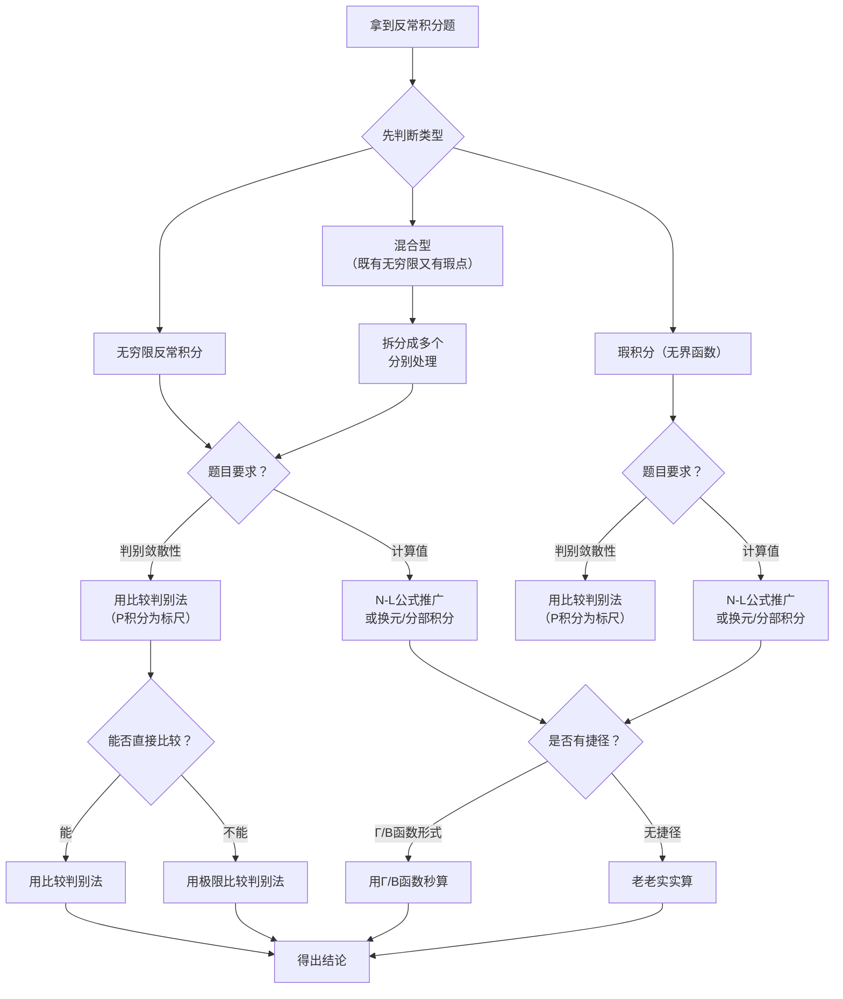

---
tags:
  - 高等数学
  - 一元函数积分学
  - 反常积分
created: 2026-07-27
---

# 反常积分的计算

## 一、基本概念

### 1. 什么是反常积分？

定积分 $\int_a^b f(x)\,\mathrm{d}x$ 要求两个前提：

- **积分区间有限**：$[a,b]$ 是有限区间
- **被积函数有界**：$f(x)$ 在 $[a,b]$ 上有界

**反常积分**就是这两个前提至少有一个不成立：

| 类型 | 突破的前提 | 别名 |
|------|-----------|------|
| 无穷限反常积分 | 积分区间**无限** | 第一类反常积分 |
| 无界函数反常积分 | 被积函数**无界** | 第二类反常积分 / 瑕积分 |

> ⚠️ 反常积分**不是 Riemann 积分**，它是 Riemann 积分加上一个**极限过程**来定义的。考研中，判断是否"可积"时常被这个坑！

---

### 2. 无穷限反常积分

#### 定义（三种情形）

$$\int_a^{+\infty} f(x)\,\mathrm{d}x = \lim_{b \to +\infty} \int_a^b f(x)\,\mathrm{d}x$$

$$\int_{-\infty}^b f(x)\,\mathrm{d}x = \lim_{a \to -\infty} \int_a^b f(x)\,\mathrm{d}x$$

$$\int_{-\infty}^{+\infty} f(x)\,\mathrm{d}x = \int_{-\infty}^c f(x)\,\mathrm{d}x + \int_c^{+\infty} f(x)\,\mathrm{d}x$$

> 💡 第三种情形：**两边拆开分别计算**。若任一边发散，整体发散。$c$ 可任取一个方便的点。

#### 敛散性定义

| 术语 | 含义 |
|------|------|
| **收敛** | 极限存在（为有限值） |
| **发散** | 极限不存在（为 $\infty$ 或不存在） |

---

### 3. 无界函数的反常积分（瑕积分）

#### 定义

若 $\lim\limits_{x \to a^+} f(x) = \infty$（即 $x=a$ 为瑕点），则：

$$\int_a^b f(x)\,\mathrm{d}x = \lim_{\varepsilon \to 0^+} \int_{a+\varepsilon}^b f(x)\,\mathrm{d}x$$

#### 三种瑕点位置

| 瑕点位置 | 定义 |
|----------|------|
| $a$ 是瑕点 | $\displaystyle\lim_{\varepsilon \to 0^+} \int_{a+\varepsilon}^b f(x)\,\mathrm{d}x$ |
| $b$ 是瑕点 | $\displaystyle\lim_{\varepsilon \to 0^+} \int_a^{b-\varepsilon} f(x)\,\mathrm{d}x$ |
| $c \in (a,b)$ 是瑕点 | $\displaystyle\int_a^c + \int_c^b$，两边分别计算 |

> ⚠️ **关键**：必须先找出瑕点！考研常见坑：$\int_{-1}^1 \frac{1}{x}\,\mathrm{d}x$ → $x=0$ 是瑕点，区间内有无界点，是反常积分而非普通定积分，不能用对称性直接得 0！

---

## 二、核心计算工具

### 1. N-L 公式的推广

对反常积分，"原函数代上下限"仍适用，但上限/下限要代**极限**：

$$\int_a^{+\infty} f(x)\,\mathrm{d}x = \lim_{x\to+\infty} F(x) - F(a)$$

记 $\displaystyle F(+\infty) = \lim_{x\to+\infty} F(x)$，则简洁写作：

$$\int_a^{+\infty} f(x)\,\mathrm{d}x = \Big[F(x)\Big]_a^{+\infty} = F(+\infty) - F(a)$$

> ⚠️ 前提：$F(x)$ 是 $f(x)$ 在相应区间上的原函数，且极限存在。

---

### 2. 换元法与分部积分法

反常积分的换元法和分部积分法**照常使用**，但极限符号要保留到最后：

#### 换元法

$$\int_a^{+\infty} f(x)\,\mathrm{d}x \xrightarrow{x=\varphi(t)} \int_{\alpha}^{\beta} f[\varphi(t)]\,\varphi'(t)\,\mathrm{d}t$$

> 💡 换元后，积分的反常类型可能改变（无穷限 ⇄ 瑕积分），这是好事情，选自己擅长的来算！

#### 分部积分法

$$\int_a^{+\infty} u\,\mathrm{d}v = \Big[uv\Big]_a^{+\infty} - \int_a^{+\infty} v\,\mathrm{d}u$$

其中 $\displaystyle\Big[uv\Big]_a^{+\infty} = \lim_{x\to+\infty} u(x)v(x) - u(a)v(a)$。

---

### 3. 利用对称性算反常积分

| 条件 | 结论 |
|------|------|
| $f$ 是**偶函数** | $\displaystyle\int_{-\infty}^{+\infty} f(x)\,\mathrm{d}x = 2\int_0^{+\infty} f(x)\,\mathrm{d}x$ |
| $f$ 是**奇函数** | $\displaystyle\int_{-\infty}^{+\infty} f(x)\,\mathrm{d}x = 0$（前提：积分收敛） |

> ⚠️ **严格来说**，奇函数在 $(-\infty,+\infty)$ 上：如果 $\int_0^{+\infty} f(x)\,\mathrm{d}x$ 收敛，则积分值为 $0$。但如果不收敛，不能直接说等于 0（如 $\int_{-\infty}^{+\infty} x\,\mathrm{d}x$ 发散，不是 0）。

---

## 三、敛散性的判别

> 考研中，"判别敛散性" 远比 "算出具体值" 更常考。**先判断，再计算。**

### 1. 定义法（直接法）

直接求极限来判断收敛还是发散。

> **例** 判别 $\displaystyle\int_1^{+\infty} \frac{1}{x^2}\,\mathrm{d}x$ 的敛散性。
>
> > [!note]- 解答
> >
> > $$\int_1^{+\infty} \frac{1}{x^2}\,\mathrm{d}x = \lim_{b\to+\infty} \left[-\frac{1}{x}\right]_1^b = \lim_{b\to+\infty} \left(1 - \frac{1}{b}\right) = 1$$
> >
> > 极限存在 → **收敛**，且积分值为 $1$。

---

### 2. P 积分（比较的标尺）

> 📌 **这是最重要的敛散性判别工具，必须牢记！**

#### 无穷限 P 积分

$$\int_1^{+\infty} \frac{1}{x^p}\,\mathrm{d}x \quad \begin{cases}
\text{收敛}, & p > 1 \\[4pt]
\text{发散}, & p \le 1
\end{cases}$$

#### 瑕积分 P 积分

$$\int_0^1 \frac{1}{x^p}\,\mathrm{d}x \quad \begin{cases}
\text{收敛}, & p < 1 \\[4pt]
\text{发散}, & p \ge 1
\end{cases}$$

> ⚠️ 一般瑕积分 $\displaystyle\int_a^b \frac{1}{(x-a)^p}\,\mathrm{d}x$ 的收敛条件也是 $p<1$。

#### 对比记忆表

| 类型 | 收敛条件 | 发散条件 | 直观理解 |
|------|----------|----------|----------|
| $\displaystyle\int_1^{+\infty}\frac{1}{x^p}\mathrm{d}x$ | $p > 1$ | $p \le 1$ | 无穷远处要 "足够小" |
| $\displaystyle\int_0^1\frac{1}{x^p}\mathrm{d}x$ | $p < 1$ | $p \ge 1$ | 瑕点附近要 "不太大" |

> 💡 **口诀**："**无穷 P 大 1 收，瑕 P 小 1 收**"
>
> - 无穷积分：$p$ **大于** 1 时收敛（$p > 1$）
> - 瑕积分：$p$ **小于** 1 时收敛（$p < 1$）

#### 推广形式

$$\int_a^{+\infty} \frac{1}{x^\alpha \ln^\beta x}\,\mathrm{d}x \quad (a>1)$$

| 条件 | 结论 |
|------|------|
| $\alpha > 1$ | **收敛**（不论 $\beta$ 如何） |
| $\alpha < 1$ | **发散**（不论 $\beta$ 如何） |
| $\alpha = 1$ 且 $\beta > 1$ | **收敛** |
| $\alpha = 1$ 且 $\beta \le 1$ | **发散** |

> 💡 $x^\alpha$ 主导敛散性，对数项 $\ln^\beta x$ 仅在 $\alpha=1$ 的临界情况起作用。

---

### 3. 比较判别法

> **基本思想**：找一个已知敛散性的"参照函数"来比较。

#### 无穷限反常积分的比较判别法

设 $0 \le f(x) \le g(x)$（$x$ 充分大时）：

| 条件 | 结论 |
|------|------|
| $\int_a^{+\infty} g(x)\,\mathrm{d}x$ 收敛 | $\int_a^{+\infty} f(x)\,\mathrm{d}x$ 收敛 |
| $\int_a^{+\infty} f(x)\,\mathrm{d}x$ 发散 | $\int_a^{+\infty} g(x)\,\mathrm{d}x$ 发散 |

> 💡 **口诀**："**大的收则小的收，小的散则大的散**"

#### 极限形式（极限比较判别法）

设 $f(x) \ge 0,\; g(x) > 0$，且 $\displaystyle\lim_{x\to+\infty} \frac{f(x)}{g(x)} = l$：

| $l$ 的值 | 结论 |
|----------|------|
| $0 < l < +\infty$ | $\int_a^{+\infty} f$ 与 $\int_a^{+\infty} g$ **同敛散** |
| $l = 0$ | 若 $\int_a^{+\infty} g$ 收敛，则 $\int_a^{+\infty} f$ 收敛 |
| $l = +\infty$ | 若 $\int_a^{+\infty} g$ 发散，则 $\int_a^{+\infty} f$ 发散 |

> 💡 极限比较法中最常用的"标尺"就是 **$p$ 积分**：取 $g(x) = \dfrac{1}{x^p}$。

---

### 4. 绝对收敛与条件收敛

| 术语 | 定义 |
|------|------|
| **绝对收敛** | $\int_a^{+\infty} |f(x)|\,\mathrm{d}x$ 收敛 |
| **条件收敛** | $\int_a^{+\infty} f(x)\,\mathrm{d}x$ 收敛，但 $\int_a^{+\infty} |f(x)|\,\mathrm{d}x$ 发散 |

> 💡 **关系**：绝对收敛 ⇒ 收敛（反之不成立）

常用于含 $\sin x$、$\cos x$ 等振荡函数的反常积分——利用 $|\sin x| \le 1$ 构造比较。

---

## 四、Γ 函数与 B 函数

> 这两个函数能把许多反常积分**秒算**出来，是考研利器。

### 1. Γ 函数（Gamma 函数）

$$\Gamma(s) = \int_0^{+\infty} x^{s-1}e^{-x}\,\mathrm{d}x \quad (s>0)$$

**核心公式**：

| 公式 | 说明 |
|------|------|
| $\Gamma(s+1) = s\Gamma(s)$ | 递推公式 |
| $\Gamma(n+1) = n!$ | $n$ 为正整数 |
| $\Gamma\left(\frac12\right) = \sqrt{\pi}$ | 经典值 |
| $\Gamma\left(\frac32\right) = \frac{\sqrt{\pi}}{2}$ | $\frac12 \cdot \Gamma(\frac12)$ |
| $\Gamma\left(\frac52\right) = \frac{3\sqrt{\pi}}{4}$ | $\frac32 \cdot \frac12 \cdot \Gamma(\frac12)$ |

> **一般公式**：$\displaystyle\Gamma\left(n+\frac12\right) = \frac{(2n-1)!!}{2^n}\sqrt{\pi}$

**换元技巧**：通过换元把积分变成 $\Gamma$ 函数的形式。

> **例** 计算 $\displaystyle\int_0^{+\infty} x^2 e^{-2x}\,\mathrm{d}x$。
>
> > [!note]- 解答
> >
> > 令 $t = 2x$，$\mathrm{d}x = \frac12 \mathrm{d}t$：
> > $$
> > \int_0^{+\infty} x^2 e^{-2x}\,\mathrm{d}x = \int_0^{+\infty} \left(\frac{t}{2}\right)^2 e^{-t} \cdot \frac12\mathrm{d}t = \frac18 \int_0^{+\infty} t^2 e^{-t}\,\mathrm{d}t = \frac18 \Gamma(3) = \frac18 \cdot 2! = \frac14
> > $$

---

### 2. B 函数（Beta 函数）

$$B(p, q) = \int_0^1 x^{p-1}(1-x)^{q-1}\,\mathrm{d}x \quad (p>0,\; q>0)$$

**核心公式**：

| 公式 | 说明 |
|------|------|
| $B(p,q) = B(q,p)$ | 对称性 |
| $B(p,q) = \dfrac{\Gamma(p)\,\Gamma(q)}{\Gamma(p+q)}$ | 与 $\Gamma$ 函数的关系 |
| $B(p,q) = 2\displaystyle\int_0^{\frac{\pi}{2}} \sin^{2p-1}\theta \cos^{2q-1}\theta\,\mathrm{d}\theta$ | 三角形式 |

> 💡 遇到 $\int_0^1 x^a(1-x)^b\,\mathrm{d}x$ 形式，秒出 $B(a+1,\,b+1)$！

---

## 五、经典题型

### 题型 1：无穷限反常积分的计算

> **例 1** 计算 $\displaystyle\int_0^{+\infty} \frac{1}{1+x^2}\,\mathrm{d}x$。

> [!note]- 解答
>
> $$
> \int_0^{+\infty} \frac{1}{1+x^2}\,\mathrm{d}x = \lim_{b\to+\infty} \Big[\arctan x\Big]_0^b = \lim_{b\to+\infty} \arctan b - 0 = \frac{\pi}{2}
> $$

---

> **例 2** 计算 $\displaystyle\int_0^{+\infty} x e^{-x^2}\,\mathrm{d}x$。

> [!note]- 解答
>
> $$
> \int_0^{+\infty} x e^{-x^2}\,\mathrm{d}x = -\frac12 \lim_{b\to+\infty} \Big[e^{-x^2}\Big]_0^b = -\frac12(0 - 1) = \frac12
> $$

---

> **例 3** 计算 $\displaystyle\int_0^{+\infty} e^{-ax}\sin bx\,\mathrm{d}x$（$a>0$）。

> [!note]- 解答
>
> 用分部积分法（或直接用公式 $\int e^{ax}\sin bx\,\mathrm{d}x$）：
> $$
> \begin{aligned}
> I &= \int_0^{+\infty} e^{-ax}\sin bx\,\mathrm{d}x \\
>   &= \lim_{R\to+\infty} \left[\frac{e^{-ax}}{a^2+b^2}\big(-a\sin bx - b\cos bx\big)\right]_0^R \\[4pt]
>   &= 0 - \frac{1}{a^2+b^2}(0 - b) = \frac{b}{a^2+b^2}
> \end{aligned}
> $$

---

### 题型 2：瑕积分的计算与判别

> **例 4** 计算 $\displaystyle\int_0^1 \frac{1}{\sqrt{x}}\,\mathrm{d}x$。

> [!note]- 解答
>
> $x=0$ 是瑕点（$1/\sqrt{x}$ 无界）：
> $$
> \int_0^1 \frac{1}{\sqrt{x}}\,\mathrm{d}x = \lim_{\varepsilon\to0^+} \Big[2\sqrt{x}\Big]_\varepsilon^1 = \lim_{\varepsilon\to0^+} (2 - 2\sqrt{\varepsilon}) = 2
> $$
> 收敛，值为 $2$。

---

> **例 5** 判别 $\displaystyle\int_0^1 \frac{\ln x}{\sqrt{x}}\,\mathrm{d}x$ 的敛散性，若收敛则求其值。

> [!note]- 解答
>
> $x=0$ 处 $\ln x \to -\infty$，是瑕点。
>
> 用分部积分法：
> $$
> \begin{aligned}
> \int_0^1 \frac{\ln x}{\sqrt{x}}\,\mathrm{d}x
> &= \lim_{\varepsilon\to0^+} \int_\varepsilon^1 \ln x \cdot x^{-1/2}\,\mathrm{d}x \\[4pt]
> &= \lim_{\varepsilon\to0^+} \left(\Big[2\sqrt{x}\ln x\Big]_\varepsilon^1 - \int_\varepsilon^1 \frac{2}{\sqrt{x}}\,\mathrm{d}x\right) \\[4pt]
> &= \lim_{\varepsilon\to0^+} \left(0 - 2\sqrt{\varepsilon}\ln\varepsilon - \Big[4\sqrt{x}\Big]_\varepsilon^1\right) \\[4pt]
> &= \lim_{\varepsilon\to0^+} \big(-2\sqrt{\varepsilon}\ln\varepsilon - 4 + 4\sqrt{\varepsilon}\big) = -4
> \end{aligned}
> $$
> > 其中 $\displaystyle\lim_{\varepsilon\to0^+} \sqrt{\varepsilon}\ln\varepsilon = 0$（幂函数比对数函数"强"）。

---

> **例 6**（考研常考坑）计算 $\displaystyle\int_{-1}^1 \frac{1}{x^2}\,\mathrm{d}x$。

> [!note]- 解答
>
> > ⚠️ $x=0$ 是瑕点！不能直接当成普通定积分 $\big[-\frac{1}{x}\big]_{-1}^1$ 来算！
>
> 拆分为两个瑕积分：
> $$
> \int_{-1}^1 \frac{1}{x^2}\,\mathrm{d}x = \int_{-1}^0 \frac{1}{x^2}\,\mathrm{d}x + \int_0^1 \frac{1}{x^2}\,\mathrm{d}x
> $$
> 两项都是 $\int_0^1 \frac{1}{x^2}\,\mathrm{d}x$（$p=2\ge1$，发散）的形式 → **发散**。

---

### 题型 3：含参变量的反常积分

> **例 7** 已知 $\displaystyle\int_0^{+\infty} \frac{\sin x}{x}\,\mathrm{d}x = \frac{\pi}{2}$（Dirichlet 积分），计算 $\displaystyle\int_0^{+\infty} \frac{\sin ax}{x}\,\mathrm{d}x$（$a>0$）。

> [!note]- 解答
>
> 令 $t = ax$，$\mathrm{d}x = \frac{1}{a}\mathrm{d}t$：
> $$
> \int_0^{+\infty} \frac{\sin ax}{x}\,\mathrm{d}x = \int_0^{+\infty} \frac{\sin t}{t/a} \cdot \frac{1}{a}\mathrm{d}t = \int_0^{+\infty} \frac{\sin t}{t}\,\mathrm{d}t = \frac{\pi}{2}
> $$
> > 💡 当 $a<0$ 时，值为 $-\frac{\pi}{2}$。一般结论：$\displaystyle\int_0^{+\infty} \frac{\sin ax}{x}\,\mathrm{d}x = \frac{\pi}{2}\operatorname{sgn}(a)$。

---

### 题型 4：敛散性判别（比较判别法）

> **例 8** 判别 $\displaystyle\int_1^{+\infty} \frac{\arctan x}{x^2}\,\mathrm{d}x$ 的敛散性。

> [!note]- 解答
>
> 当 $x \to +\infty$ 时，$\arctan x \to \dfrac{\pi}{2}$（有界），故：
> $$
> 0 \le \frac{\arctan x}{x^2} \le \frac{\pi/2}{x^2}
> $$
> $\displaystyle\int_1^{+\infty} \frac{1}{x^2}\,\mathrm{d}x$ 收敛（$p=2>1$），由比较判别法 → **收敛**。

---

> **例 9** 判别 $\displaystyle\int_1^{+\infty} \frac{\ln x}{x^p}\,\mathrm{d}x$ 的敛散性（与 $p$ 的关系）。

> [!note]- 解答
>
> 极限比较法：取 $g(x) = \frac{1}{x^q}$，其中 $q$ 介于 $1$ 和 $p$ 之间：
>
> - 若 $p > 1$：取 $q = \frac{p+1}{2} > 1$，则 $\lim_{x\to+\infty} \frac{\ln x/x^p}{1/x^q} = \lim_{x\to+\infty} \frac{\ln x}{x^{p-q}} = 0$。
>   而 $\int_1^{+\infty} \frac{1}{x^q}\,\mathrm{d}x$ 收敛（$q>1$）→ 原积分**收敛**。
>
> - 若 $p \le 1$：$\frac{\ln x}{x^p} \ge \frac{\ln x}{x}$（$x$ 充分大时 $\ln x \ge 1$），而 $\int_1^{+\infty} \frac{\ln x}{x}\,\mathrm{d}x$ 发散 → 原积分**发散**。
>
> | $p$ | 敛散性 |
> |-----|--------|
> | $p > 1$ | 收敛 |
> | $p \le 1$ | 发散 |

---

> **例 10** 判别 $\displaystyle\int_0^{+\infty} \frac{\sin x}{x}\,\mathrm{d}x$ 的敛散性（条件收敛）。

> [!note]- 解答
>
> - **收敛性**：用 Dirichlet 判别法（$\frac{1}{x}$ 单调趋于 0，$\int_0^A \sin x\,\mathrm{d}x$ 有界）→ 收敛。
> - **非绝对收敛**：$\int_0^{+\infty} \frac{|\sin x|}{x}\,\mathrm{d}x$ 发散（$|\sin x| \ge \sin^2 x = \frac{1-\cos2x}{2}$，发散）。
>
> 结论：**条件收敛**，$\displaystyle\int_0^{+\infty} \frac{\sin x}{x}\,\mathrm{d}x = \frac{\pi}{2}$。

---

### 题型 5：利用 Γ 函数 / B 函数快速计算

> **例 11** 计算 $\displaystyle\int_0^{+\infty} x^4 e^{-x}\,\mathrm{d}x$。

> [!note]- 解答
>
> 直接识别为 $\Gamma(5)$：
> $$\int_0^{+\infty} x^4 e^{-x}\,\mathrm{d}x = \Gamma(5) = 4! = 24$$

---

> **例 12** 计算 $\displaystyle\int_0^1 x^3(1-x)^2\,\mathrm{d}x$。

> [!note]- 解答
>
> 识别为 $B(4, 3)$：
> $$\int_0^1 x^3(1-x)^2\,\mathrm{d}x = B(4, 3) = \frac{\Gamma(4)\,\Gamma(3)}{\Gamma(7)} = \frac{3! \cdot 2!}{6!} = \frac{6 \cdot 2}{720} = \frac{1}{60}$$

---

> **例 13** 计算 $\displaystyle\int_0^{+\infty} e^{-x^2}\,\mathrm{d}x$（泊松积分）。

> [!note]- 解答
>
> 令 $t = x^2$，$x = \sqrt{t}$，$\mathrm{d}x = \frac{1}{2\sqrt{t}}\mathrm{d}t$：
> $$
> \int_0^{+\infty} e^{-x^2}\,\mathrm{d}x = \frac12 \int_0^{+\infty} t^{-1/2} e^{-t}\,\mathrm{d}t = \frac12\,\Gamma\!\left(\frac12\right) = \frac{\sqrt{\pi}}{2}
> $$

---

## 六、解题步骤总结

---

## 七、关键经验

| 编号 | 原则 |
|------|------|
| 1 | **先判断类型**：无穷限还是瑕积分？区间内有瑕点吗？（这是最常见的坑） |
| 2 | **先判别敛散性**：很多题只要求判别，不需要算值，用 $p$ 积分 + 比较判别法 |
| 3 | **瑕积分注意**：有界是 Riemann 可积的必要条件，$\int_{-1}^1 \frac{1}{x}\,\mathrm{d}x$ 是反常积分！ |
| 4 | **P 积分是尺子**：$p>1$ 无穷收，$p<1$ 瑕收——**对比记忆，不要搞反** |
| 5 | **对数项是噪音**：$\frac{\ln x}{x^p}$ 的敛散性取决于 $p$，$\ln x$ 只影响临界情况 |
| 6 | **对称性要小心**：奇函数在 $(-\infty,+\infty)$ 上积分为 0，**前提是积分收敛** |
| 7 | **分部积分照用**：反常积分的分部积分法不变，但极限符号要带上 |
| 8 | **Γ / B 函数秒杀**：遇到 $\int x^n e^{-ax}\,\mathrm{d}x$ 或 $\int x^a(1-x)^b\,\mathrm{d}x$，先用换元凑成标准形式 |

---

## 八、常用结论速查

### 必背的六个值

| 积分 | 值 |
|------|-----|
| $\displaystyle\int_0^{+\infty} e^{-x^2}\,\mathrm{d}x$ | $\dfrac{\sqrt{\pi}}{2}$（泊松积分） |
| $\displaystyle\int_{-\infty}^{+\infty} e^{-x^2}\,\mathrm{d}x$ | $\sqrt{\pi}$ |
| $\displaystyle\int_0^{+\infty} \frac{\sin x}{x}\,\mathrm{d}x$ | $\dfrac{\pi}{2}$（Dirichlet 积分） |
| $\displaystyle\int_0^{+\infty} \frac{1}{1+x^2}\,\mathrm{d}x$ | $\dfrac{\pi}{2}$ |
| $\displaystyle\int_0^1 \frac{1}{\sqrt{x}}\,\mathrm{d}x$ | $2$ |
| $\displaystyle\int_0^1 \ln x\,\mathrm{d}x$ | $-1$ |

### P 积分敛散性速查

| 积分 | 收敛条件 |
|------|----------|
| $\displaystyle\int_1^{+\infty} \frac{1}{x^p}\,\mathrm{d}x$ | $p > 1$ |
| $\displaystyle\int_0^1 \frac{1}{x^p}\,\mathrm{d}x$ | $p < 1$ |
| $\displaystyle\int_a^b \frac{1}{(x-a)^p}\,\mathrm{d}x$ | $p < 1$ |
| $\displaystyle\int_a^b \frac{1}{(b-x)^p}\,\mathrm{d}x$ | $p < 1$ |
| $\displaystyle\int_2^{+\infty} \frac{1}{x\ln^p x}\,\mathrm{d}x$ | $p > 1$ |

### Γ 函数常用值

| $s$ | $\Gamma(s)$ |
|-----|------------|
| $1$ | $1$ |
| $2$ | $1$ |
| $3$ | $2$ |
| $4$ | $6$（$3!$） |
| $n+1$ | $n!$ |
| $\frac12$ | $\sqrt{\pi}$ |
| $\frac32$ | $\frac{\sqrt{\pi}}{2}$ |
| $\frac52$ | $\frac{3\sqrt{\pi}}{4}$ |
