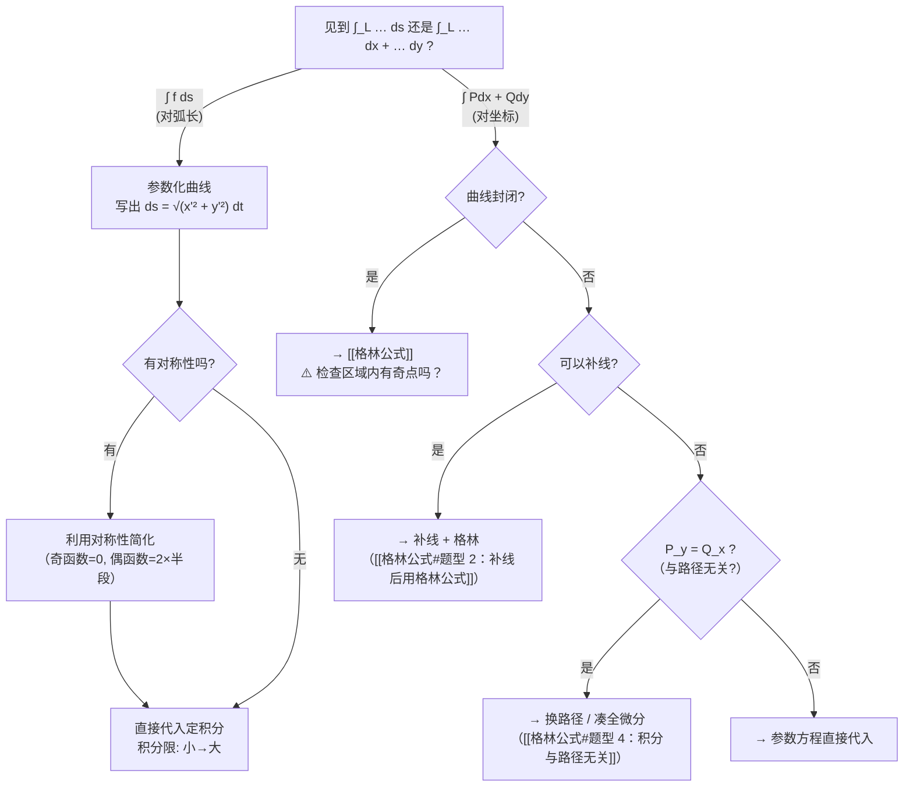

---
tags:
  - 高数/曲线积分
  - 考研/数学
created: 2026-07-19
updated: 2026/07/19
---

# 曲线积分

曲线积分分为两类：

|          | 第一类（对弧长）                      | 第二类（对坐标）               |
| -------- | ----------------------------- | ---------------------- |
| **记号**   | $\int_L f(x,y)\,ds$           | $\int_L P\,dx + Q\,dy$ |
| **物理意义** | 曲线质量（线密度 $f$）                 | 力做功（力 $\vec{F}=(P,Q)$） |
| **方向性**  | 与方向无关                         | 反向则变号                  |
| **核心公式** | $ds = \sqrt{x'^2 + y'^2}\,dt$ | 直接代入参数方程               |
| **延展定理** | —                             | [[格林公式]] / [[斯托克斯公式]]  |

---

## 一、第一类曲线积分（对弧长的曲线积分）

### 1. 定义

$$
\int_L f(x,y)\,ds = \lim_{\lambda \to 0} \sum_{i=1}^{n} f(\xi_i, \eta_i)\,\Delta s_i
$$

> $ds$ 是**弧长微元**，永远是正的。积分值与曲线的**方向无关**。

---

### 2. 计算方法

**核心**：将曲线用参数表示，代入 $ds$ 公式 → 化为定积分。

#### 情况 ① 参数方程：$x = x(t),\; y = y(t),\; \alpha \le t \le \beta$

$$
\boxed{\int_L f(x,y)\,ds = \int_\alpha^\beta f\big(x(t), y(t)\big) \cdot \sqrt{x'(t)^2 + y'(t)^2}\;dt}
$$

> ⚠️ **注意**：积分限必须是**小 → 大**（$\alpha < \beta$），因为 $ds > 0$。

#### 情况 ② 显函数：$y = y(x),\; a \le x \le b$

$$
\boxed{\int_L f(x,y)\,ds = \int_a^b f\big(x, y(x)\big) \cdot \sqrt{1 + y'(x)^2}\;dx}
$$

#### 情况 ③ 极坐标：$r = r(\theta),\; \alpha \le \theta \le \beta$

$$
\boxed{\int_L f(x,y)\,ds = \int_\alpha^\beta f\big(r\cos\theta, r\sin\theta\big) \cdot \sqrt{r(\theta)^2 + r'(\theta)^2}\;d\theta}
$$

因为 $x = r\cos\theta,\; y = r\sin\theta$，$ds = \sqrt{r^2 + r'^2}\,d\theta$。

#### 情况 ④ 空间曲线（三维）：$x = x(t),\; y = y(t),\; z = z(t)$

$$
\boxed{\int_L f(x,y,z)\,ds = \int_\alpha^\beta f\big(x(t),y(t),z(t)\big) \cdot \sqrt{x'(t)^2 + y'(t)^2 + z'(t)^2}\;dt}
$$

---

### 3. 对称性（第一类）

> 第一类曲线积分的对称性与**重积分对称性**相同：看被积函数奇偶性 + 曲线对称性。

| 曲线对称性 | 被积函数性质 | 结果 |
|---|---|---|
| $L$ 关于 $y$ 轴对称 | $f$ 关于 $x$ 是**偶函数** | $= 2\int_{L_1}$（一半） |
| $L$ 关于 $y$ 轴对称 | $f$ 关于 $x$ 是**奇函数** | $= 0$ |
| $L$ 关于 $x$ 轴对称 | $f$ 关于 $y$ 是**偶函数** | $= 2\int_{L_1}$（一半） |
| $L$ 关于 $x$ 轴对称 | $f$ 关于 $y$ 是**奇函数** | $= 0$ |
| $L$ 关于 $y=x$ 对称 | — | $\int_L f(x,y)\,ds = \int_L f(y,x)\,ds$ |

> **轮换对称性**：若曲线方程中 $x,y$ 地位对等（如 $x^2+y^2=R^2$），则 $\int_L f(x)\,ds = \int_L f(y)\,ds$。

---

### 4. 经典题型：第一类曲线积分

#### 题型 1.1：参数方程直接代入

> **必背参数方程**：

| 曲线 | 参数方程 | $ds$ |
|---|---|---|
| 圆 $x^2+y^2=R^2$ | $x=R\cos t,\; y=R\sin t$ | $ds = R\,dt$ |
| 椭圆 $\frac{x^2}{a^2}+\frac{y^2}{b^2}=1$ | $x=a\cos t,\; y=b\sin t$ | $ds = \sqrt{a^2\sin^2 t + b^2\cos^2 t}\,dt$ |
| 摆线 $\begin{cases}x=a(t-\sin t)\\y=a(1-\cos t)\end{cases}$ | 参数 $t$ | $ds = 2a\sin\frac{t}{2}\,dt$（一拱: $t\in[0,2\pi]$） |
| 星形线 $x^{2/3}+y^{2/3}=a^{2/3}$ | $x=a\cos^3 t,\; y=a\sin^3 t$ | $ds = 3a|\sin t\cos t|\,dt$ |
| 直线段：从 $A$ 到 $B$ | $x=x_A+t(x_B-x_A),\; y=y_A+t(y_B-y_A)$ | $ds = |AB|\,dt$ |

---

##### 例 1（圆）⭐ 基础

> 计算 $\displaystyle \int_L (x^2 + y^2)\,ds$，其中 $L$ 是 $x^2 + y^2 = R^2$ 的上半圆周。

**解**：参数方程 $x = R\cos t,\; y = R\sin t,\; t \in [0, \pi]$

在 $L$ 上 $x^2 + y^2 = R^2$（常数），$ds = R\,dt$：

$$
\int_L (x^2 + y^2)\,ds = \int_0^\pi R^2 \cdot R\,dt = R^3 \cdot \pi = \pi R^3
$$

> 💡 **技巧**：被积函数在曲线上恰好为常数时，直接提出！

---

##### 例 2（摆线）⭐⭐ 经典

> 计算 $\displaystyle \int_L \sqrt{2y}\,ds$，其中 $L$ 是摆线 $x = a(t-\sin t),\; y = a(1-\cos t)$ 的第一拱 ($t \in [0, 2\pi]$)。

**解**：

先算 $ds$：
$$
x' = a(1-\cos t),\; y' = a\sin t
$$
$$
ds = \sqrt{a^2(1-\cos t)^2 + a^2\sin^2 t}\,dt = a\sqrt{2 - 2\cos t}\,dt = 2a\sin\frac{t}{2}\,dt
$$

（用了 $1-\cos t = 2\sin^2\frac{t}{2}$）

在 $L$ 上 $\sqrt{2y} = \sqrt{2a(1-\cos t)} = \sqrt{4a\sin^2\frac{t}{2}} = 2\sqrt{a}\sin\frac{t}{2}$

$$
\int_L \sqrt{2y}\,ds = \int_0^{2\pi} 2\sqrt{a}\sin\frac{t}{2} \cdot 2a\sin\frac{t}{2}\,dt
= 4a^{3/2} \int_0^{2\pi} \sin^2\frac{t}{2}\,dt
$$
$$
= 4a^{3/2} \int_0^{2\pi} \frac{1-\cos t}{2}\,dt = 4a^{3/2} \cdot \pi = 4\pi a^{3/2}
$$

---

##### 例 3（星形线 + 对称性）⭐⭐ 经典

> 计算 $\displaystyle \int_L (x^{4/3} + y^{4/3})\,ds$，其中 $L$ 是星形线 $x^{2/3} + y^{2/3} = a^{2/3}$。

**解**：参数方程 $x = a\cos^3 t,\; y = a\sin^3 t,\; t \in [0, 2\pi]$

$$
ds = \sqrt{(-3a\cos^2 t\sin t)^2 + (3a\sin^2 t\cos t)^2}\,dt = 3a|\sin t\cos t|\,dt
$$

由**对称性**，只需算第一象限 ($t \in [0, \pi/2]$) $\times 4$：

在 $L$ 上 $x^{4/3} + y^{4/3} = a^{4/3}(\cos^4 t + \sin^4 t)$

$$
\int_L = 4\int_0^{\pi/2} a^{4/3}(\cos^4 t + \sin^4 t) \cdot 3a\sin t\cos t\,dt
$$

令 $u = \sin t$，或者直接用 $\int_0^{\pi/2} \sin^m t \cos^n t\,dt$ 公式：

$\int_0^{\pi/2} \cos^4 t \cdot \sin t\cos t\,dt = \int_0^{\pi/2} \cos^5 t \sin t\,dt = \frac{1}{6}$

最终 $= 4a^{7/3}$。

> 💡 **技巧**：星形线全长的第一类积分，善用对称性分成四段。

---

#### 题型 1.2：对称性简化技巧

##### 例 4（轮换对称）⭐

> 计算 $\displaystyle \int_L x^2\,ds$，其中 $L$ 是 $x^2 + y^2 = R^2$。

**解**：由轮换对称性，
$$
\int_L x^2\,ds = \int_L y^2\,ds = \frac{1}{2}\int_L (x^2 + y^2)\,ds = \frac{1}{2}\int_L R^2\,ds = \frac{R^2}{2} \cdot 2\pi R = \pi R^3
$$

> 💡 利用 $x^2 + y^2 = R^2$ 常数化 + 轮换对称，不用参数方程就能秒杀。

---

##### 例 5（奇偶对称）⭐

> 计算 $\displaystyle \int_L xy\,ds$，其中 $L$ 是 $x^2 + y^2 = R^2$ 的上半圆周。

**解**：上半圆关于 $y$ 轴对称，$xy$ 关于 $x$ 是奇函数，故 $\int_L xy\,ds = 0$。

---

#### 题型 1.3：空间曲线积分

##### 例 6（空间螺旋线）⭐⭐

> 计算 $\displaystyle \int_\Gamma (x^2 + y^2 + z^2)\,ds$，其中 $\Gamma$ 是螺旋线 $x = a\cos t,\; y = a\sin t,\; z = bt,\; t \in [0, 2\pi]$。

**解**：
$$
ds = \sqrt{(-a\sin t)^2 + (a\cos t)^2 + b^2}\,dt = \sqrt{a^2 + b^2}\,dt
$$

在 $\Gamma$ 上 $x^2 + y^2 + z^2 = a^2 + b^2 t^2$

$$
\int_\Gamma (x^2 + y^2 + z^2)\,ds = \int_0^{2\pi} (a^2 + b^2 t^2) \cdot \sqrt{a^2 + b^2}\,dt
$$
$$
= \sqrt{a^2 + b^2} \left[ a^2 \cdot 2\pi + b^2 \cdot \frac{(2\pi)^3}{3} \right]
= 2\pi\sqrt{a^2+b^2}\left(a^2 + \frac{4\pi^2 b^2}{3}\right)
$$

---

## 二、第二类曲线积分（对坐标的曲线积分）

### 1. 定义

$$
\int_L P(x,y)\,dx + Q(x,y)\,dy = \lim_{\lambda \to 0} \sum_{i=1}^n \big[P(\xi_i,\eta_i)\,\Delta x_i + Q(\xi_i,\eta_i)\,\Delta y_i\big]
$$

> ⚠️ **方向性**：$\displaystyle \int_{-L} P\,dx + Q\,dy = -\int_L P\,dx + Q\,dy$

---

### 2. 直接计算法（参数方程代入）

设 $L: x = x(t),\; y = y(t)$，$t$ 从 **起点** $\alpha$ → **终点** $\beta$：

$$
\boxed{\int_L P\,dx + Q\,dy = \int_\alpha^\beta \Big[P\big(x(t),y(t)\big)\,x'(t) + Q\big(x(t),y(t)\big)\,y'(t)\Big]\,dt}
$$

> ⚠️ 注意：此处积分限 **起点 → 终点**，方向由曲线的定向决定！不同于第一类的小→大。

---

### 3. 两类曲线积分的关系

$$
\boxed{\int_L P\,dx + Q\,dy = \int_L (P\cos\alpha + Q\cos\beta)\,ds}
$$

其中 $(\cos\alpha, \cos\beta)$ 是曲线 $L$ 在每一点的**单位切向量**（沿 $L$ 方向）。

> 用 $\vec{\tau} = (dx/ds,\; dy/ds)$ 或弧微分 $dx = \cos\alpha\,ds,\; dy = \cos\beta\,ds$ 理解。

---

### 4. 经典题型：第二类曲线积分（直接计算 + 格林前的基础题）

> 格林公式的题型（封闭曲线直接套、补线法、挖洞法、路径无关、求面积）见 **[[格林公式]]**，此处不重复。

#### 题型 2.1：参数方程直接代入

##### 例 7（圆上定向积分）⭐

> 计算 $\displaystyle \int_L (x^2 - y^2)\,dx + xy\,dy$，其中 $L$ 是 $x^2 + y^2 = R^2$ 的上半圆周，取逆时针方向从 $A(R,0)$ 到 $B(-R,0)$。

**解**：参数方程 $x = R\cos t,\; y = R\sin t$，$A(R,0) \to B(-R,0)$ 对应 $t: 0 \to \pi$（逆时针）

$dx = -R\sin t\,dt,\; dy = R\cos t\,dt$

$$
\begin{aligned}
\int_L &= \int_0^\pi \big[(R^2\cos^2 t - R^2\sin^2 t)(-R\sin t) + (R\cos t \cdot R\sin t)(R\cos t)\big]\,dt \\[4pt]
&= R^3\int_0^\pi \big[-\cos^2 t\sin t + \sin^3 t + \sin t\cos^2 t\big]\,dt \\[4pt]
&= R^3\int_0^\pi \sin^3 t\,dt = R^3 \cdot \frac{4}{3} = \frac{4}{3}R^3
\end{aligned}
$$

---

##### 例 8（折线段）⭐

> 计算 $\displaystyle \int_L 2xy\,dx + x^2\,dy$，其中 $L$ 是折线 $O(0,0) \to A(1,0) \to B(1,1)$。

**解**：分段计算。

**$OA$ 段**：$y = 0$，$dy = 0$，$x: 0 \to 1$
$$
\int_{OA} 2x\cdot 0\,dx + x^2\cdot 0 = 0
$$

**$AB$ 段**：$x = 1$，$dx = 0$，$y: 0 \to 1$
$$
\int_{AB} 2\cdot 1\cdot y \cdot 0 + 1^2\,dy = \int_0^1 dy = 1
$$

所以原式 $= 0 + 1 = 1$。

> 💡 此题的 $P\,dx + Q\,dy = 2xy\,dx + x^2\,dy$ 恰好是 $d(x^2y)$（全微分），所以积分 $= x^2y\Big|_{(0,0)}^{(1,1)} = 1$。全微分的判定见 [[格林公式#题型 4：积分与路径无关]]。

---

#### 题型 2.2：利用起点终点直接求（全微分凑微分法）

若 $P\,dx + Q\,dy = dF$（即 $\frac{\partial P}{\partial y} = \frac{\partial Q}{\partial x}$ 且区域单连通），则：

$$
\boxed{\int_L P\,dx + Q\,dy = F(B) - F(A)}
$$

> 详细判定条件和求原函数的方法见 [[格林公式#题型 4：积分与路径无关]]。

##### 例 9（凑微分）⭐

> 计算 $\displaystyle \int_L (2x + y)\,dx + (x + 2y)\,dy$，其中 $L$ 是从 $A(0,0)$ 到 $B(1,2)$ 的任意光滑曲线。

**解**：$P = 2x+y$，$Q = x+2y$，$\frac{\partial P}{\partial y} = 1 = \frac{\partial Q}{\partial x}$，与路径无关。

凑微分：$(2x+y)dx + (x+2y)dy = d(x^2 + xy + y^2)$

$$
\int_L = (x^2 + xy + y^2)\Big|_{(0,0)}^{(1,2)} = 1 + 2 + 4 - 0 = 7
$$

---

## 三、两类曲线积分对比总结

| 对比维度 | 第一类（对弧长） | 第二类（对坐标） |
|---|---|---|
| **积分元** | $ds$（弧长，正值） | $dx, dy$（有正负） |
| **方向** | 与方向无关 | 反向变号 |
| **物理意义** | 质量 | 做功 |
| **三维推广** | $\int f(x,y,z)ds$ | $\int Pdx+Qdy+Rdz$ |
| **参数化后** | $ds = \sqrt{x'^2+y'^2}\,dt$，积分限小→大 | $dx = x'dt,\; dy = y'dt$，积分限起点→终点 |
| **核心技巧** | 对称性、常数化 | [[格林公式]]、全微分 |
| **封闭曲线** | $\oint f\,ds$（无特殊定理） | $\oint Pdx+Qdy \xrightarrow{\text{格林}} \iint (Q_x-P_y)dxdy$ |

---

## 四、解题路线总图

---

## 五、相关笔记链接

- [[格林公式]] —— 第二类曲线积分的核心定理
- [[二重积分计算]] —— 格林公式的终点
- [[关于积分计算的对称性的总结]] —— 各种积分的对称性速查
- [[曲面积分]] —— 高维推广
- [[一重积分计算]] —— 最终的定积分计算基本功
