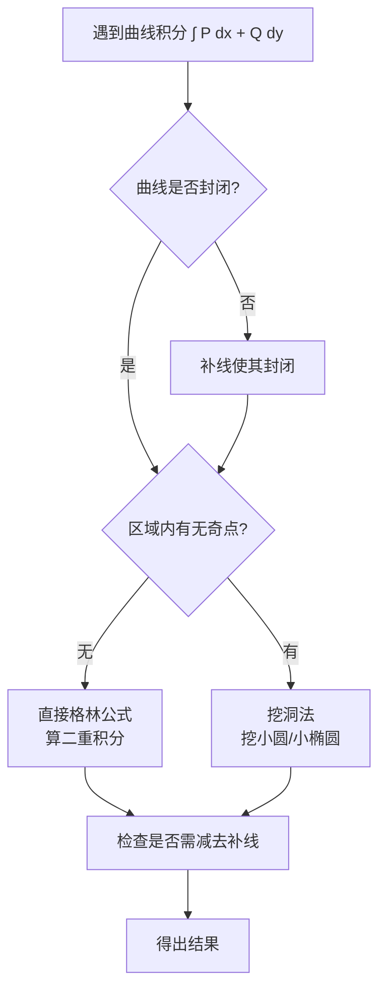

---
tags:
  - 高数/曲线积分
  - 考研/数学
created: 2026-07-18T21:21:00
updated: 2026/07/18
---

# 格林公式 (Green's Theorem)

## 一、定理内容

> 设闭区域 $D$ 由分段光滑的曲线 $L$ 围成，函数 $P(x,y)$、$Q(x,y)$ 在 $D$ 上具有一阶连续偏导数，则有：
> 
> $$
> \oint_L P\,dx + Q\,dy = \iint_D \left( \frac{\partial Q}{\partial x} - \frac{\partial P}{\partial y} \right) dx\,dy
> $$
> 
> 其中 $L$ 是 $D$ 的**正向边界曲线**（外边界逆时针，内边界顺时针）。

### 记忆口诀

> **"绿（格）公式：外逆内顺，Q 偏 x 减 P 偏 y"**

通俗记法：想算封闭曲线上的积分 $\oint Pdx+Qdy$，就转化为在区域内算「Q 对 x 的偏导」减去「P 对 y 的偏导」的二重积分。

---

## 二、使用条件（重点！）

使用格林公式必须同时满足以下三条：

| 条件        | 说明                                    |
| --------- | ------------------------------------- |
| ① **封闭性** | 曲线 $L$ 必须是**封闭曲线**                    |
| ② **正向性** | 曲线取**正向**（外逆内顺）                       |
| ③ **连续性** | $P,Q$ 在 $D$ 内**有一阶连续偏导数**（若无连续偏导，需挖洞） |

> ⚠️ **易错点**：题目给出的曲线如果不封闭，先**补线**再用格林；若 $D$ 内有奇点（分母为零的点），需**挖洞**处理。

---

## 三、常见题型与解法

### 题型 1：计算封闭曲线上的第二类曲线积分

^33057c

**方法**：直接用格林公式转化为二重积分。

**套路**：
$$
\oint_L P\,dx + Q\,dy = \iint_D (Q_x - P_y)\,dx\,dy
$$

**典型例题**：

> **例1** 计算 $\oint_L (x^2y - y)\,dx + (x^3 + 2xy)\,dy$，其中 $L$ 是 $x^2 + y^2 = a^2$ 的逆时针方向。

**解**：
$P = x^2y - y$，$Q = x^3 + 2xy$
$$
\frac{\partial Q}{\partial x} = 3x^2 + 2y,\quad 
\frac{\partial P}{\partial y} = x^2 - 1
$$
$$
Q_x - P_y = (3x^2 + 2y) - (x^2 - 1) = 2x^2 + 2y + 1
$$

由格林公式：
$$
\iint_D (2x^2 + 2y + 1)\,dx\,dy
$$

由对称性，$2x^2$ 和 $2y$ 的积分为零（$y$ 是奇函数，$2x^2$ 对称后可用极坐标或 $x^2$ 对称性）：

$\iint_D 2x^2\,dx\,dy = 2 \cdot \frac{1}{2} \iint_D (x^2+y^2)\,dx\,dy = \iint_D r^2 \cdot r\,dr\,d\theta = \int_0^{2\pi} d\theta \int_0^a r^3\,dr = 2\pi \cdot \frac{a^4}{4} = \frac{\pi a^4}{2}$

$\iint_D 2y\,dx\,dy = 0$ （奇对称）

$\iint_D 1\,dx\,dy = \pi a^2$

所以原式 $= \frac{\pi a^4}{2} + \pi a^2$。

---

### 题型 2：补线后用格林公式

**适用场景**：曲线 $L$ **不封闭**，但计算 $\int_L Pdx+Qdy$ 困难。

**方法**：
1. 补一条简单曲线 $L_0$（通常为坐标轴上的直线段或圆弧），使 $L + L_0$ 封闭
2. 对封闭曲线用格林公式
3. 再减去补线上的积分（补线通常容易计算）

**套路公式**：
$$
\int_L = \oint_{L+L_0} - \int_{L_0}
$$

> **例2** 计算 $\int_L (e^x\sin y - 2y)\,dx + (e^x\cos y - 2)\,dy$，其中 $L$ 是从 $A(0,0)$ 沿 $y = \sqrt{2x - x^2}$ 到 $B(2,0)$ 的弧段。

**解**：补 $L_0$：从 $B(2,0)$ 沿 $x$ 轴回到 $A(0,0)$ 的直线段。

$P = e^x\sin y - 2y$, $Q = e^x\cos y - 2$
$$
\frac{\partial Q}{\partial x} = e^x\cos y,\quad 
\frac{\partial P}{\partial y} = e^x\cos y - 2
$$
$$
Q_x - P_y = e^x\cos y - (e^x\cos y - 2) = 2
$$

由格林公式：
$$
\oint_{L+L_0} Pdx + Qdy = \iint_D 2\,dx\,dy = 2 \times (\text{半圆面积}) = 2 \times \frac{1}{2}\pi \cdot 1^2 = \pi
$$

其中 $D$ 是 $y = \sqrt{2x - x^2}$ 与 $x$ 轴围成的半圆 $(x-1)^2 + y^2 = 1,\; y \ge 0$。

计算补线上的积分：$L_0$ 上 $y=0$，$dy=0$，$x$ 从 $2$ 到 $0$
$$
\int_{L_0} Pdx + Qdy = \int_2^0 (e^x\cdot 0 - 0)\,dx + 0 = 0
$$

所以：
$$
\int_L = \pi - 0 = \pi
$$

---

### 题型 3：挖洞法（处理奇点）

**适用场景**：$P,Q$ 在 $D$ 内**有奇点**（无定义或偏导不连续），不能直接套格林公式。

**方法**：在奇点周围挖一个很小的圆（或椭圆），外边界逆时针、内边界顺时针，在内边界和外边界之间的环域上使用格林公式。

> **例3** 计算 $\oint_L \frac{x\,dy - y\,dx}{x^2 + y^2}$，其中 $L$ 是包围原点的正向封闭曲线。

**解**：$P = \frac{-y}{x^2 + y^2}$，$Q = \frac{x}{x^2 + y^2}$

在原点处 $P,Q$ 无定义，是奇点。

取 $L_\varepsilon$：以原点为圆心、$\varepsilon$ 为半径的小圆，取顺时针方向（对内边界来说，正向是顺时针，与外边界方向相反才能使 $D$ 在中间）。

在 $L$ 与 $L_\varepsilon$ 之间的区域上，用格林公式可算得 $Q_x - P_y = 0$，所以：
$$
\oint_{L + L_\varepsilon} = \iint 0 = 0 \quad \Rightarrow \quad \oint_L = -\oint_{L_\varepsilon}
$$

在 $L_\varepsilon$ 上：$x = \varepsilon\cos\theta$, $y = \varepsilon\sin\theta$，$dx = -\varepsilon\sin\theta\,d\theta$, $dy = \varepsilon\cos\theta\,d\theta$ （$L_\varepsilon$ 取顺时针，$\theta$ 从 $2\pi$ 到 $0$）

代入计算：
$$
\oint_{L_\varepsilon} \frac{x\,dy - y\,dx}{x^2+y^2} 
= \int_{2\pi}^0 \frac{\varepsilon\cos\theta \cdot \varepsilon\cos\theta\,d\theta - \varepsilon\sin\theta \cdot (-\varepsilon\sin\theta\,d\theta)}{\varepsilon^2} 
= \int_{2\pi}^0 1\,d\theta = -2\pi
$$

所以：$\displaystyle \oint_L = -(-2\pi) = 2\pi$

---

### 题型 4：积分与路径无关

**定理**：在单连通区域 $D$ 上，以下四句话等价：

1. $\int_L Pdx + Qdy$ 在 $D$ 内与路径无关（只与起点终点有关）
2. $\oint_L Pdx + Qdy = 0$ 对 $D$ 内任意封闭曲线成立
3. 存在 $F(x,y)$ 使得 $dF = Pdx + Qdy$
4. $\displaystyle \frac{\partial P}{\partial y} = \frac{\partial Q}{\partial x}$ 在 $D$ 内恒成立

> **例4** 确定 $a,b$ 的值，使得表达式 $(y^2 + 2ax^3y)\,dx + (2bx^2y^2 + 3x)\,dy$ 是某个函数的全微分，并求出该函数。

**解**：
$P = y^2 + 2ax^3y$，$Q = 2bx^2y^2 + 3x$

全微分条件：$\displaystyle \frac{\partial P}{\partial y} = \frac{\partial Q}{\partial x}$

$$
\frac{\partial P}{\partial y} = 2y + 2ax^3,\quad 
\frac{\partial Q}{\partial x} = 4bxy^2 + 3
$$

恒等得：
$$
2y + 2ax^3 \equiv 4bxy^2 + 3
$$
比较系数：
- $y$ 项：$2 = 0$？不成立... 需要覆盖所有 $(x,y)$ 恒成立

实际上需要：
- $x^3$ 项：$2a = 0 \Rightarrow a = 0$
- $xy^2$ 项：$4b = 0 \Rightarrow b = 0$
- 常数项：$0 = 3$？仍然矛盾

这说明不存在这样的 $a,b$ 使之成为全微分。

> ⚠️ **注意**：全微分条件要求 $\frac{\partial P}{\partial y}$ 与 $\frac{\partial Q}{\partial x}$ 中对应项系数分别相等，若出现矛盾项，则不存在。

---

### 题型 5：用格林公式求面积

**公式**：闭区域 $D$ 的面积可以用曲线积分计算
$$
A = \iint_D dx\,dy = \frac{1}{2}\oint_L x\,dy - y\,dx
$$

> **例5** 用曲线积分求椭圆 $\frac{x^2}{a^2} + \frac{y^2}{b^2} = 1$ 的面积。

**解**：椭圆参数方程：$x = a\cos t$, $y = b\sin t$, $t: 0 \to 2\pi$

$$
A = \frac{1}{2}\oint_L x\,dy - y\,dx 
= \frac{1}{2}\int_0^{2\pi} [a\cos t \cdot b\cos t - b\sin t \cdot (-a\sin t)]\,dt
$$
$$
= \frac{1}{2}\int_0^{2\pi} (ab\cos^2 t + ab\sin^2 t)\,dt 
= \frac{1}{2}\int_0^{2\pi} ab\,dt = \pi ab
$$

---

## 四、易错点总结

| 易错点 | 说明 |
|--------|------|
| 🔴 忘记反向 | 曲线方向改变，结果变号 |
| 🔴 忽略奇点 | 区域内有奇点直接套公式会算错 |
| 🔴 补线方向 | 补线后要保证整体是正向封闭 |
| 🔴 偏导顺序 | 是 $Q_x - P_y$，不是 $P_y - Q_x$ |
| 🔴 $P,Q$ 对应错误 | $P$ 配 $dx$，$Q$ 配 $dy$，别搞反 |
| 🔴 单连通条件 | 积分与路径无关的前提是区域单连通 |

---

## 五、解题流程图

---

## 六、相关知识点链接

- [[二重积分计算]] —— 格林公式常转化为二重积分
- [[曲线积分]] —— 第一类、第二类曲线积分基础
- [[曲面积分]]
- [[斯托克斯公式]] —— 格林公式在三维的推广
- [[如何利用高斯公式解曲面积分]] 
