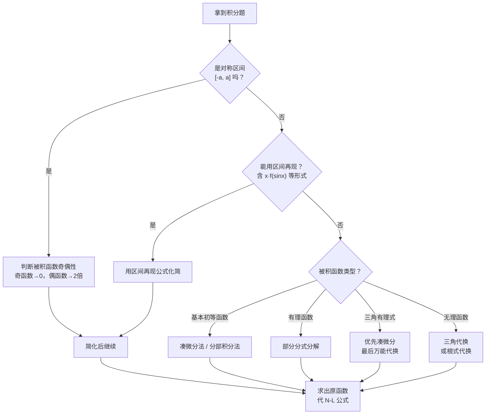

---
tags:
  - 高等数学
  - 一元函数积分学
  - 定积分
created: 2026-07-19
---

# 一重积分计算

## 一、基本概念

### 1. 定积分的定义

分割 → 近似 → 求和 → 取极限：

$$\int_a^b f(x)\,\mathrm{d}x = \lim_{\lambda \to 0} \sum_{i=1}^{n} f(\xi_i) \Delta x_i$$

其中 $\lambda = \max\{\Delta x_i\}$ 为最大子区间长度。

### 2. 几何意义

- **曲边梯形的面积**：$\displaystyle\int_a^b f(x)\,\mathrm{d}x$（$f(x) \ge 0$ 时）
- $f(x)$ 有正有负时 → "正面积" $-$ "负面积"
- **物理意义**：变速直线运动的路程、变力做功等

### 3. 可积条件

| 条件 | 结论 |
|------|------|
| $f(x)$ 在 $[a,b]$ 上**连续** | 必可积 |
| $f(x)$ 在 $[a,b]$ 上**有界**，且只有有限个间断点 | 必可积 |
| $f(x)$ 在 $[a,b]$ 上**单调有界** | 必可积 |

> ⚠️ **无界函数不可积**（有界是可积的必要条件）

---

## 二、核心计算工具

### 1. 牛顿-莱布尼茨公式（N-L 公式）

> **基本定理**：若 $F'(x) = f(x)$，则
> $$\int_a^b f(x)\,\mathrm{d}x = F(b) - F(a) = \Big[F(x)\Big]_a^b$$

**适用前提**：$f(x)$ 在 $[a,b]$ 上连续（或可积），$F(x)$ 是 $f(x)$ 的一个原函数。

---

### 2. 不定积分：两大基本方法

> 定积分的计算**本质**是求原函数，因此不定积分的方法是基础。

#### 方法一：第一类换元法（凑微分法）

$$\int f[\varphi(x)]\,\varphi'(x)\,\mathrm{d}x = \int f(u)\,\mathrm{d}u \quad (u = \varphi(x))$$

> **核心**：将被积表达式凑成 $f(u)\,\mathrm{d}u$ 的形式。

**常见凑微分公式**：

| 被积形式 | 凑微分 |
|----------|--------|
| $\displaystyle\int f(ax+b)\,\mathrm{d}x$ | $\displaystyle\frac{1}{a}\int f(ax+b)\,\mathrm{d}(ax+b)$ |
| $\displaystyle\int f(x^n)\,x^{n-1}\mathrm{d}x$ | $\displaystyle\frac{1}{n}\int f(x^n)\,\mathrm{d}(x^n)$ |
| $\displaystyle\int f(\sin x)\cos x\,\mathrm{d}x$ | $\int f(\sin x)\,\mathrm{d}(\sin x)$ |
| $\displaystyle\int f(\cos x)\sin x\,\mathrm{d}x$ | $-\int f(\cos x)\,\mathrm{d}(\cos x)$ |
| $\displaystyle\int f(\ln x)\,\frac{1}{x}\mathrm{d}x$ | $\int f(\ln x)\,\mathrm{d}(\ln x)$ |
| $\displaystyle\int f(e^x)\,e^x\mathrm{d}x$ | $\int f(e^x)\,\mathrm{d}(e^x)$ |
| $\displaystyle\int f(\tan x)\,\sec^2 x\,\mathrm{d}x$ | $\int f(\tan x)\,\mathrm{d}(\tan x)$ |
| $\displaystyle\int f(\arcsin x)\,\frac{1}{\sqrt{1-x^2}}\mathrm{d}x$ | $\int f(\arcsin x)\,\mathrm{d}(\arcsin x)$ |
| $\displaystyle\int f(\arctan x)\,\frac{1}{1+x^2}\mathrm{d}x$ | $\int f(\arctan x)\,\mathrm{d}(\arctan x)$ |

#### 方法二：分部积分法

$$\int u\,\mathrm{d}v = uv - \int v\,\mathrm{d}u$$

**选取 $u$ 的优先级**（反对幂指三 / LIATE）：

| 优先级 | 函数类型 | 举例 | 原因 |
|--------|----------|------|------|
| 1 | **对**数函数 | $\ln x$ | 求导后变简单 |
| 2 | **反**三角函数 | $\arcsin x$, $\arctan x$ | 求导后变代数函数 |
| 3 | **幂**函数 | $x^n$ | 求导降次 |
| 4 | **指**数函数 | $e^x$, $a^x$ | 求导不变（放后面） |
| 5 | **三**角函数 | $\sin x$, $\cos x$ | 求导在三角函数间循环（放后面） |

> 💡 **口诀**："反对幂指三"，越靠前的越当 $u$（越靠后的越当 $\mathrm{d}v$）。

**三种经典分部积分模式**：

| 类型 | 设 $u=$ | 设 $\mathrm{d}v=$ | 说明 |
|------|---------|-------------------|------|
| $\int x^n e^{ax}\,\mathrm{d}x$ | $x^n$ | $e^{ax}\mathrm{d}x$ | 降幂，做 $n$ 次 |
| $\int x^n \sin ax\,\mathrm{d}x$ | $x^n$ | $\sin ax\,\mathrm{d}x$ | 同上 |
| $\int e^{ax}\sin bx\,\mathrm{d}x$ | 任意 | 另一部分 | 做两次，解方程 |
| $\int P(x)\ln x\,\mathrm{d}x$ | $\ln x$ | $P(x)\mathrm{d}x$ | 对数一定优先当 $u$ |
| $\int P(x)\arctan x\,\mathrm{d}x$ | $\arctan x$ | $P(x)\mathrm{d}x$ | 反三角优先当 $u$ |

---

### 3. 三类特殊函数的积分

#### ① 有理函数的积分

> **通法**：部分分式分解（待定系数法）

$$\frac{P(x)}{Q(x)} = \text{多项式} + \sum\frac{A}{(x-a)^k} + \sum\frac{Bx+C}{(x^2+px+q)^m}$$

**四种基本分式的积分公式**：

| 分式                                                       | 积分结果                                  |
| -------------------------------------------------------- | ------------------------------------- |
| $\displaystyle\int\frac{1}{x-a}\,\mathrm{d}x$            | $\ln\|x-a\| + C$                      |
| $\displaystyle\int\frac{1}{(x-a)^k}\,\mathrm{d}x$（$k>1$） | $-\dfrac{1}{(k-1)(x-a)^{k-1}} + C$    |
| $\displaystyle\int\frac{1}{x^2+a^2}\,\mathrm{d}x$        | $\dfrac{1}{a}\arctan\dfrac{x}{a} + C$ |
| $\displaystyle\int\frac{x}{x^2+a^2}\,\mathrm{d}x$        | $\dfrac{1}{2}\ln(x^2+a^2) + C$        |

#### ② 三角有理函数的积分

> **通用代换**（万能公式）：令 $t = \tan\dfrac{x}{2}$：
> $$\sin x = \frac{2t}{1+t^2},\quad \cos x = \frac{1-t^2}{1+t^2},\quad \mathrm{d}x = \frac{2}{1+t^2}\mathrm{d}t$$

> ⚠️ 万能代换是"最后武器"，优先尝试以下方法：

**优先策略**：

| 条件 | 方法 |
|------|------|
| $R(-\sin x, \cos x) = -R(\sin x, \cos x)$ | 凑 $\mathrm{d}(\cos x)$，令 $u=\cos x$ |
| $R(\sin x, -\cos x) = -R(\sin x, \cos x)$ | 凑 $\mathrm{d}(\sin x)$，令 $u=\sin x$ |
| $R(-\sin x, -\cos x) = R(\sin x, \cos x)$ | 凑 $\mathrm{d}(\tan x)$，令 $u=\tan x$ |
| 以上都不满足 | 万能代换 $t = \tan\frac{x}{2}$ |

**常见三角积分公式**：

$$\int \sin^n x\,\mathrm{d}x,\; \int \cos^n x\,\mathrm{d}x$$
- **$n$ 为奇数**：拆一次幂，凑微分
- **$n$ 为偶数**：用倍角公式降幂：$\sin^2 x = \frac{1-\cos2x}{2}$，$\cos^2 x = \frac{1+\cos2x}{2}$

$$\int \tan^n x\,\mathrm{d}x = \frac{\tan^{n-1}x}{n-1} - \int \tan^{n-2}x\,\mathrm{d}x$$

#### ③ 简单无理函数的积分

| 被积函数含 | 代换 |
|-----------|------|
| $\sqrt{a^2-x^2}$ | $x = a\sin t$ 或 $x = a\cos t$ |
| $\sqrt{a^2+x^2}$ | $x = a\tan t$ |
| $\sqrt{x^2-a^2}$ | $x = a\sec t$ |
| $\sqrt[n]{ax+b}$ | $t = \sqrt[n]{ax+b}$ |
| $\sqrt[n]{\dfrac{ax+b}{cx+d}}$ | $t = \sqrt[n]{\dfrac{ax+b}{cx+d}}$ |

---

### 4. 定积分的特有方法

#### ① 定积分的换元法

$$\int_a^b f(x)\,\mathrm{d}x \xrightarrow{x=\varphi(t)} \int_{\alpha}^{\beta} f[\varphi(t)]\,\varphi'(t)\,\mathrm{d}t$$

> ⚠️ **三要素必须同步换**：被积函数、积分变量、**积分上下限**。

#### ② 定积分的分部积分法

$$\int_a^b u\,\mathrm{d}v = \Big[uv\Big]_a^b - \int_a^b v\,\mathrm{d}u$$

> 与不定积分类似，但每一步都要带上限。

---

## 三、定积分的简化技巧

### 技巧 1：利用对称性（奇偶性）

| 条件 | 结论 |
|------|------|
| $f(x)$ 在 $[-a,a]$ 上连续，$f(x)$ 为**偶函数** | $\displaystyle\int_{-a}^a f(x)\,\mathrm{d}x = 2\int_0^a f(x)\,\mathrm{d}x$ |
| $f(x)$ 在 $[-a,a]$ 上连续，$f(x)$ 为**奇函数** | $\displaystyle\int_{-a}^a f(x)\,\mathrm{d}x = 0$ |

> 💡 **考试必备**：拿到对称区间的积分，先判断奇偶性！

### 技巧 2：周期性函数

若 $f(x)$ 是以 $T$ 为周期的连续函数，则：

$$\int_a^{a+T} f(x)\,\mathrm{d}x = \int_0^T f(x)\,\mathrm{d}x$$

即：在任意长度为 $T$ 的区间上积分，结果相同。

### 技巧 3：区间再现公式

$$\int_a^b f(x)\,\mathrm{d}x = \int_a^b f(a+b-x)\,\mathrm{d}x$$

**常用推论**：

$$\int_0^{\frac{\pi}{2}} f(\sin x)\,\mathrm{d}x = \int_0^{\frac{\pi}{2}} f(\cos x)\,\mathrm{d}x$$

$$\int_0^\pi x f(\sin x)\,\mathrm{d}x = \frac{\pi}{2}\int_0^\pi f(\sin x)\,\mathrm{d}x$$

### 技巧 4：Wallis 公式

$$\int_0^{\frac{\pi}{2}} \sin^n x\,\mathrm{d}x = \int_0^{\frac{\pi}{2}} \cos^n x\,\mathrm{d}x = \begin{cases}
\dfrac{n-1}{n} \cdot \dfrac{n-3}{n-2} \cdots \dfrac{1}{2} \cdot \dfrac{\pi}{2}, & n \text{ 为偶数} \\[8pt]
\dfrac{n-1}{n} \cdot \dfrac{n-3}{n-2} \cdots \dfrac{2}{3} \cdot 1, & n \text{ 为奇数}
\end{cases}$$

---

## 四、反常积分（广义积分）

### 1. 无穷限反常积分

$$\int_a^{+\infty} f(x)\,\mathrm{d}x = \lim_{b \to +\infty} \int_a^b f(x)\,\mathrm{d}x$$

> **敛散性判别**（比较判别法）：
>
> $$\int_1^{+\infty} \frac{1}{x^p}\,\mathrm{d}x \begin{cases}
> \text{收敛}, & p > 1 \\
> \text{发散}, & p \le 1
> \end{cases}$$

### 2. 无界函数的反常积分（瑕积分）

若 $\lim\limits_{x \to a^+} f(x) = \infty$（$x=a$ 为瑕点），则：

$$\int_a^b f(x)\,\mathrm{d}x = \lim_{\varepsilon \to 0^+} \int_{a+\varepsilon}^b f(x)\,\mathrm{d}x$$

> **$\boldsymbol{p}$ 积分的敛散性**：
>
> $$\int_0^1 \frac{1}{x^p}\,\mathrm{d}x \begin{cases}
> \text{收敛}, & p < 1 \\
> \text{发散}, & p \ge 1
> \end{cases}$$

### 3. 两个判别法的对比

| 类型 | 判别积分 | 收敛条件 | 发散条件 |
|------|----------|----------|----------|
| 无穷限 | $\displaystyle\int_1^{+\infty}\frac{1}{x^p}\mathrm{d}x$ | $p > 1$ | $p \le 1$ |
| 瑕积分 | $\displaystyle\int_0^1\frac{1}{x^p}\mathrm{d}x$ | $p < 1$ | $p \ge 1$ |

> 💡 **记忆**：无穷远处要 "够小"（$p>1$ 收敛），瑕点附近要 "不太大"（$p<1$ 收敛）。

---

## 五、Γ 函数（考研扩展）

$$\Gamma(s) = \int_0^{+\infty} x^{s-1}e^{-x}\,\mathrm{d}x \quad (s>0)$$

**常用结论**：

| 公式 | 说明 |
|------|------|
| $\Gamma(s+1) = s\Gamma(s)$ | 递推公式 |
| $\Gamma(n+1) = n!$ | $n$ 为正整数 |
| $\Gamma\left(\frac12\right) = \sqrt{\pi}$ | 等价于泊松积分 $\int_0^{+\infty}e^{-x^2}\mathrm{d}x = \frac{\sqrt{\pi}}{2}$ |
| $\Gamma\left(\frac32\right) = \frac{\sqrt{\pi}}{2}$ | |

---

## 六、经典题型

### 题型 1：凑微分法的运用

> **例 1** 计算 $\displaystyle\int \frac{\ln x}{x}\,\mathrm{d}x$。

> [!note]- 解答
>
> $$
> \int \frac{\ln x}{x}\,\mathrm{d}x = \int \ln x\,\mathrm{d}(\ln x) = \frac{1}{2}(\ln x)^2 + C
> $$

> **例 2** 计算 $\displaystyle\int_0^{\frac{\pi}{2}} \sin^3 x\,\mathrm{d}x$。

> [!note]- 解答
>
> 解法一（凑微分）：
> $$
> \int_0^{\frac{\pi}{2}} \sin^3 x\,\mathrm{d}x = \int_0^{\frac{\pi}{2}} (1-\cos^2 x)\sin x\,\mathrm{d}x = -\int_0^{\frac{\pi}{2}} (1-\cos^2 x)\,\mathrm{d}(\cos x)
> $$
> 令 $u=\cos x$，$x:0\to\frac{\pi}{2}$ 对应 $u:1\to0$：
> $$= -\int_1^0 (1-u^2)\,\mathrm{d}u = \int_0^1 (1-u^2)\,\mathrm{d}u = \left[u - \frac{u^3}{3}\right]_0^1 = \frac{2}{3}$$
>
> 解法二（Wallis公式）：$n=3$ 为奇数，$\displaystyle\int_0^{\frac{\pi}{2}} \sin^3x\,\mathrm{d}x = \frac{2}{3}\cdot1 = \frac{2}{3}$。

---

### 题型 2：分部积分法

> **例 3** 计算 $\displaystyle\int x e^x\,\mathrm{d}x$。

> [!note]- 解答
>
> 设 $u=x$，$\mathrm{d}v = e^x\mathrm{d}x$，则 $\mathrm{d}u = \mathrm{d}x$，$v = e^x$：
> $$\int x e^x\,\mathrm{d}x = x e^x - \int e^x\,\mathrm{d}x = x e^x - e^x + C = e^x(x-1) + C$$

> **例 4** 计算 $\displaystyle\int_0^1 x\arctan x\,\mathrm{d}x$。

> [!note]- 解答
>
> 设 $u=\arctan x$，$\mathrm{d}v = x\mathrm{d}x$，
> 则 $\mathrm{d}u = \frac{1}{1+x^2}\mathrm{d}x$，$v = \frac{x^2}{2}$。
>
> $$
> \begin{aligned}
> \int_0^1 x\arctan x\,\mathrm{d}x &= \left[\frac{x^2}{2}\arctan x\right]_0^1 - \frac12\int_0^1 \frac{x^2}{1+x^2}\,\mathrm{d}x \\[4pt]
> &= \frac{\pi}{8} - \frac12\int_0^1 \left(1 - \frac{1}{1+x^2}\right)\mathrm{d}x \\[4pt]
> &= \frac{\pi}{8} - \frac12\Big[x - \arctan x\Big]_0^1 \\[4pt]
> &= \frac{\pi}{8} - \frac12\left(1 - \frac{\pi}{4}\right) = \frac{\pi}{4} - \frac12
> \end{aligned}
> $$

---

### 题型 3：有理函数积分

> **例 5** 计算 $\displaystyle\int \frac{1}{x^2-a^2}\,\mathrm{d}x$。

> [!note]- 解答
>
> $$
> \frac{1}{x^2-a^2} = \frac{1}{2a}\left(\frac{1}{x-a} - \frac{1}{x+a}\right)
> $$
>
> $$
> \int \frac{1}{x^2-a^2}\,\mathrm{d}x = \frac{1}{2a}\ln\left|\frac{x-a}{x+a}\right| + C
> $$

---

### 题型 4：三角代换（无理函数）

> **例 6** 计算 $\displaystyle\int_0^a \sqrt{a^2-x^2}\,\mathrm{d}x$（$a>0$）。

> [!note]- 解答
>
> 令 $x = a\sin t$，$\mathrm{d}x = a\cos t\,\mathrm{d}t$，
> $x:0 \to a$ 对应 $t:0 \to \frac{\pi}{2}$：
>
> $$
> \begin{aligned}
> \int_0^a \sqrt{a^2-x^2}\,\mathrm{d}x &= \int_0^{\frac{\pi}{2}} a\cos t \cdot a\cos t\,\mathrm{d}t \\
> &= a^2 \int_0^{\frac{\pi}{2}} \cos^2 t\,\mathrm{d}t \\
> &= a^2 \cdot \frac{1}{2} \cdot \frac{\pi}{2} = \frac{\pi a^2}{4}
> \end{aligned}
> $$
>
> > 💡 几何意义：这就是半径为 $a$ 的圆的 **1/4 面积**。

---

### 题型 5：利用对称性

> **例 7** 计算 $\displaystyle\int_{-\pi}^{\pi} x^2 \sin x\,\mathrm{d}x$。

> [!note]- 解答
>
> $x^2$ 为偶函数，$\sin x$ 为奇函数 → 被积函数 $x^2\sin x$ 在对称区间上为奇函数。
>
> $$\int_{-\pi}^{\pi} x^2 \sin x\,\mathrm{d}x = 0$$

> **例 8** 计算 $\displaystyle\int_{-2}^{2} \frac{|x|+x}{1+x^2}\,\mathrm{d}x$。

> [!note]- 解答
>
> 拆分为偶函数 + 奇函数：
> $$\int_{-2}^{2} \frac{|x|}{1+x^2}\,\mathrm{d}x + \int_{-2}^{2} \frac{x}{1+x^2}\,\mathrm{d}x$$
>
> 前者：$|x|/(1+x^2)$ 为偶函数 → $2\int_0^2 \frac{x}{1+x^2}\,\mathrm{d}x = \ln 5$
>
> 后者：奇函数在对称区间上 → $0$
>
> 结果为 $\ln 5$。

---

### 题型 6：区间再现公式

> **例 9** 计算 $\displaystyle\int_0^{\pi} \frac{x\sin x}{1+\cos^2 x}\,\mathrm{d}x$。

> [!note]- 解答
>
> 利用 $\int_0^\pi x f(\sin x)\,\mathrm{d}x = \frac{\pi}{2}\int_0^\pi f(\sin x)\,\mathrm{d}x$：
>
> $$
> \begin{aligned}
> I &= \frac{\pi}{2} \int_0^{\pi} \frac{\sin x}{1+\cos^2 x}\,\mathrm{d}x \\
> &= \frac{\pi}{2} \cdot \left[-\arctan(\cos x)\right]_0^\pi \\
> &= \frac{\pi}{2} \cdot \left((-\arctan(-1)) - (-\arctan(1))\right) \\
> &= \frac{\pi}{2} \cdot \left(\frac{\pi}{4} + \frac{\pi}{4}\right) = \frac{\pi^2}{4}
> \end{aligned}
> $$

---

### 题型 7：反常积分

> **例 10** 判别 $\displaystyle\int_1^{+\infty} \frac{1}{x\sqrt{x}}\,\mathrm{d}x$ 的敛散性，若收敛则求值。

> [!note]- 解答
>
> $\frac{1}{x\sqrt{x}} = x^{-3/2}$，$p = \frac32 > 1$，故收敛。
>
> $$
> \int_1^{+\infty} x^{-3/2}\,\mathrm{d}x = \lim_{b\to+\infty} \left[-2x^{-1/2}\right]_1^b = \lim_{b\to+\infty} \left(2 - \frac{2}{\sqrt{b}}\right) = 2
> $$

---

## 七、解题步骤总结

---

## 八、关键经验

| 编号 | 原则 |
|------|------|
| 1 | **先看对称性** → 奇偶性能直接秒杀很多题 |
| 2 | **先看能不能凑微分** → 凑微分比换元快 |
| 3 | **分部积分时**：对数/反三角优先当 $u$（反对幂指三） |
| 4 | **三角积分**：奇数拆+凑微分，偶数用倍角降幂 |
| 5 | **遇到困难积分**：考虑区间再现公式 |
| 6 | **反常积分**：先判别敛散性（$p$ 积分），再求值 |
| 7 | **定积分换元**：三要素同步换（函数、变量、**限**！） |

---

## 九、常用积分公式速查

### 基本积分表

| 积分 | 结果 |
|------|------|
| $\displaystyle\int x^n\,\mathrm{d}x$ | $\dfrac{x^{n+1}}{n+1}+C$（$n\ne-1$） |
| $\displaystyle\int \frac{1}{x}\,\mathrm{d}x$ | $\ln\|x\| + C$ |
| $\displaystyle\int e^x\,\mathrm{d}x$ | $e^x + C$ |
| $\displaystyle\int a^x\,\mathrm{d}x$ | $\dfrac{a^x}{\ln a} + C$ |
| $\displaystyle\int \sin x\,\mathrm{d}x$ | $-\cos x + C$ |
| $\displaystyle\int \cos x\,\mathrm{d}x$ | $\sin x + C$ |
| $\displaystyle\int \sec^2 x\,\mathrm{d}x$ | $\tan x + C$ |
| $\displaystyle\int \csc^2 x\,\mathrm{d}x$ | $-\cot x + C$ |
| $\displaystyle\int \sec x\tan x\,\mathrm{d}x$ | $\sec x + C$ |
| $\displaystyle\int \csc x\cot x\,\mathrm{d}x$ | $-\csc x + C$ |
| $\displaystyle\int \tan x\,\mathrm{d}x$ | $-\ln\|\cos x\| + C$ |
| $\displaystyle\int \cot x\,\mathrm{d}x$ | $\ln\|\sin x\| + C$ |
| $\displaystyle\int \sec x\,\mathrm{d}x$ | $\ln\|\sec x + \tan x\| + C$ |
| $\displaystyle\int \csc x\,\mathrm{d}x$ | $\ln\|\csc x - \cot x\| + C$ |

### 含二次根式的积分

| 积分 | 结果 |
|------|------|
| $\displaystyle\int \frac{1}{\sqrt{a^2-x^2}}\,\mathrm{d}x$ | $\arcsin\dfrac{x}{a} + C$ |
| $\displaystyle\int \frac{1}{a^2+x^2}\,\mathrm{d}x$ | $\dfrac{1}{a}\arctan\dfrac{x}{a} + C$ |
| $\displaystyle\int \frac{1}{\sqrt{x^2\pm a^2}}\,\mathrm{d}x$ | $\ln\|x + \sqrt{x^2\pm a^2}\| + C$ |
| $\displaystyle\int \frac{1}{x^2-a^2}\,\mathrm{d}x$ | $\dfrac{1}{2a}\ln\left\|\dfrac{x-a}{x+a}\right\| + C$ |

### 常用定积分值

| 积分 | 值 |
|------|-----|
| $\displaystyle\int_0^{\frac{\pi}{2}} \sin^n x\,\mathrm{d}x$ | Wallis 公式（见上文） |
| $\displaystyle\int_0^{+\infty} e^{-x^2}\,\mathrm{d}x$ | $\dfrac{\sqrt{\pi}}{2}$ |
| $\displaystyle\int_0^{\frac{\pi}{2}} \ln\sin x\,\mathrm{d}x$ | $-\dfrac{\pi}{2}\ln 2$ |
| $\displaystyle\int_{-\infty}^{+\infty} e^{-x^2}\,\mathrm{d}x$ | $\sqrt{\pi}$（泊松积分） |
