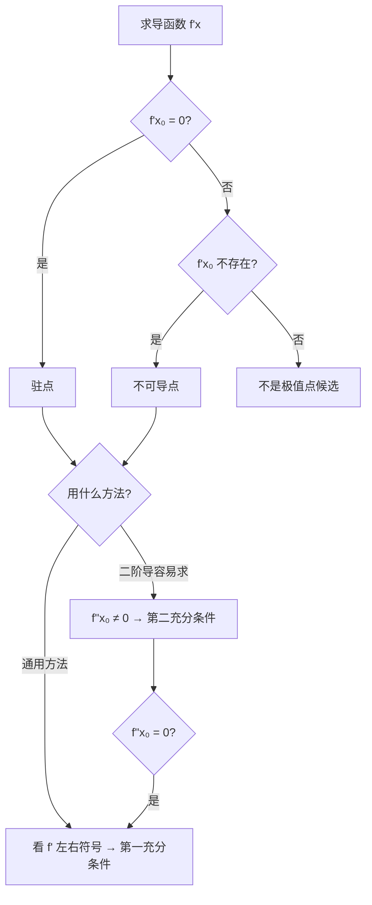
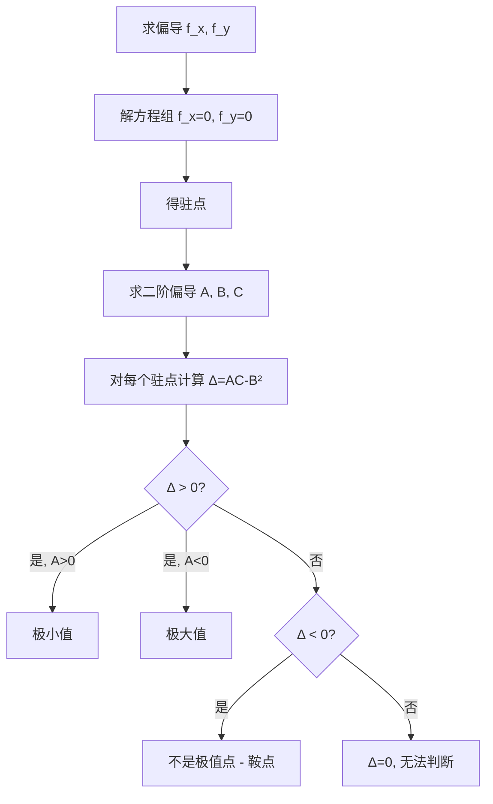

---
tags:
  - 高等数学
  - 一元函数微分学
  - 多元函数微分学
  - 极值
created: 2026-07-30
---

# 求函数极值点

> 极值点是**局部**概念——只关心在 $x_0$ 附近 $f(x)$ 是否取到最值，和整个区间上的最值不同。

---

## 一、一元函数极值

### 1. 定义

设 $f(x)$ 在 $x_0$ 的某邻域内有定义：

- **极大值**：存在 $\delta > 0$，使得 $x \in U(x_0, \delta)$ 时，$f(x) \le f(x_0)$
- **极小值**：存在 $\delta > 0$，使得 $x \in U(x_0, \delta)$ 时，$f(x) \ge f(x_0)$

> ⚠️ **极值 ≠ 最值**：极值是局部的，最值是全局的；极值可以有多个，最值只有一个（或没有）。

### 2. 极值点与驻点

| 概念 | 定义 | 关系 |
|------|------|------|
| **驻点** | $f'(x_0) = 0$ 的点 | 不一定是极值点（如 $y = x^3$ 在 $x = 0$） |
| **不可导点** | $f'(x_0)$ 不存在的点 | 可能是极值点（如 $y = |x|$ 在 $x = 0$） |
| **极值点** | $f(x_0)$ 为极值的点 | 只能是**驻点**或**不可导点** |

> **核心结论**：极值点 $\subseteq$ {驻点} $\cup$ {不可导点}

### 3. 必要条件

若 $f(x)$ 在 $x_0$ 处**可导**且取得**极值**，则：

$$f'(x_0) = 0$$

> ⚠️ **逆命题不成立**：$f'(x_0) = 0$ 推不出 $x_0$ 是极值点。例如 $f(x) = x^3$，$f'(0) = 0$ 但 $x = 0$ 不是极值点。

### 4. 第一充分条件（一阶导数判别法）

设 $f(x)$ 在 $x_0$ 处连续，在去心邻域内可导：

| $x < x_0$ 时 $f'(x)$ 符号 | $x > x_0$ 时 $f'(x)$ 符号 | 结论 |
|:------------------------:|:------------------------:|:----:|
| $+$ | $-$ | **极大值** |
| $-$ | $+$ | **极小值** |
| $+$ | $+$ | 不是极值点 |
| $-$ | $-$ | 不是极值点 |

> **记忆**：导数符号 "先正后负 → 极大，先负后正 → 极小"

**适用场景**：
- $f'(x_0) = 0$（驻点）
- $f'(x_0)$ 不存在（不可导点）
- $f''(x_0) = 0$（二阶失效时）

### 5. 第二充分条件（二阶导数判别法）

若 $f'(x_0) = 0$，$f''(x_0)$ 存在：

| $f''(x_0)$ | 结论 |
|:----------:|:----:|
| $< 0$ | **极大值** |
| $> 0$ | **极小值** |
| $= 0$ | **无法判断**（改用第一充分条件） |

> **直观理解**：二阶导 $> 0$ → 曲线凹向上 → 极小值；二阶导 $< 0$ → 曲线凸向下 → 极大值。

**两种充分条件的对比**：

| | 第一充分条件 | 第二充分条件 |
|------|:----------:|:----------:|
| **依据** | 一阶导数符号变化 | 二阶导数符号 |
| **范围** | 驻点 + 不可导点都适用 | 仅适用于驻点 |
| **优势** | 适用面广 | 计算简单（只算二阶导） |
| **弱点** | 需要讨论左右符号 | $f''=0$ 时失效 |

### 6. 求一元函数极值的标准步骤

1. 求 $f'(x)$
2. 找出所有**驻点**（$f'(x) = 0$）和**不可导点**
3. 用第一或第二充分条件逐个判断
4. 写出极值点和极值

---

## 二、多元函数极值（以二元为例）

### 1. 无条件极值

#### 定义

设 $z = f(x, y)$ 在 $(x_0, y_0)$ 的某邻域内有定义：

- **极大值**：$f(x, y) \le f(x_0, y_0)$ 在邻域内恒成立
- **极小值**：$f(x, y) \ge f(x_0, y_0)$ 在邻域内恒成立

#### 必要条件

若 $f(x, y)$ 在 $(x_0, y_0)$ 处**可微**且取得**极值**，则：

$$f_x(x_0, y_0) = 0, \quad f_y(x_0, y_0) = 0$$

> 满足 $\nabla f = \mathbf{0}$ 的点称为**驻点**。极值点必为驻点（对可微函数）。

#### 充分条件

记 $A = f_{xx}(x_0, y_0)$，$B = f_{xy}(x_0, y_0)$，$C = f_{yy}(x_0, y_0)$

判别式 $\Delta = AC - B^2$：

| $\Delta$ | $A$ | 结论 |
|:--------:|:---:|:----:|
| $> 0$ | $> 0$ | **极小值** |
| $> 0$ | $< 0$ | **极大值** |
| $< 0$ | — | **不是极值点**（鞍点） |
| $= 0$ | — | **无法判断**（需其他方法） |

> **记忆口诀**："AC 减 B 方，正为极值副为鞍，A 正极小 A 负极"

#### 求无条件极值的步骤

### 2. 条件极值（拉格朗日乘数法）

求 $z = f(x, y)$ 在约束 $\varphi(x, y) = 0$ 下的极值。

#### 方法

构造拉格朗日函数：

$$F(x, y, \lambda) = f(x, y) + \lambda \,\varphi(x, y)$$

解方程组：

$$
\begin{cases}
F_x = f_x + \lambda \varphi_x = 0 \\[4pt]
F_y = f_y + \lambda \varphi_y = 0 \\[4pt]
F_{\lambda} = \varphi(x, y) = 0
\end{cases}
$$

解出可能的极值点 $(x_0, y_0)$，再根据实际问题的意义判断是否为极值。

> **考研常见套路**：条件极值通常出现在**几何应用题**中（如"求曲面上距离原点最近的点"），此时根据问题的实际意义不需要判断二阶条件。

#### 多元 / 多约束推广

- **三元单约束**：$F(x, y, z, \lambda) = f(x, y, z) + \lambda \varphi(x, y, z)$
- **三元双约束**：$F(x, y, z, \lambda, \mu) = f + \lambda \varphi_1 + \mu \varphi_2$

### 3. 闭区域上的最值问题

求 $f(x, y)$ 在**有界闭区域** $D$ 上的最值：

| 步骤 | 操作 |
|:----:|------|
| ① | 求 $D$ **内部**的驻点，计算这些点的函数值 |
| ② | 将边界方程代入 $f(x, y)$，化为**一元函数极值问题**（或用拉格朗日乘数法） |
| ③ | 比较所有候选点的函数值，取最大 / 最小 |

> ⚠️ **易错点**：闭区域最值和无条件极值是两回事！闭区域的最值可能在边界取到。

---

## 三、考研常考题型

### 题型 1：一元隐函数的极值

> 如 $y = y(x)$ 由方程 $F(x, y) = 0$ 确定，求 $y(x)$ 的极值。

**方法**：
1. 隐函数求导得 $y'$
2. 令 $y' = 0$ 结合原方程求驻点
3. 再求 $y''$ 用第二充分条件判断

### 题型 2：由参数方程确定的函数极值

> 如 $\begin{cases} x = \varphi(t) \\ y = \psi(t) \end{cases}$，求 $y(x)$ 的极值。

**方法**：
$$\frac{dy}{dx} = \frac{\psi'(t)}{\varphi'(t)}$$
令 $\dfrac{dy}{dx} = 0$（即 $\psi'(t) = 0$ 且 $\varphi'(t) \neq 0$）求驻点。

> 二阶导：$\dfrac{d^2y}{dx^2} = \dfrac{\psi''(t)\varphi'(t) - \psi'(t)\varphi''(t)}{[\varphi'(t)]^3}$

### 题型 3：多元函数条件极值的实际应用题

> "求曲面 $z = f(x, y)$ 到原点的最短距离"等几何问题。

**方法**：
- 设距离平方 $d^2 = x^2 + y^2 + z^2$
- 将 $z = f(x, y)$ 代入，化为求二元函数极值（或用拉格朗日乘数法）

---

## 四、易错提醒

| 易错点 | 正确理解 |
|--------|----------|
| 极值点 = 驻点 | ❌ 极值点还可能是不可导点 |
| 驻点 = 极值点 | ❌ $y = x^3$ 在 $x = 0$ 是驻点但不是极值点 |
| $f'(x_0) = 0$ 就有极值 | ❌ 必须验证左右导数符号变化 |
| $f''(x_0) = 0$ 就没有极值 | ❌ $y = x^4$ 在 $x = 0$ 处 $f' = f'' = 0$，但有极小值 |
| 多元驻点就是极值点 | ❌ 需验证 $AC - B^2$ |
| 闭区域最值只在内部取 | ❌ 往往在边界上取到最值 |

---

## 五、相关链接

- [[一重积分计算]]
- [[格林公式]]
